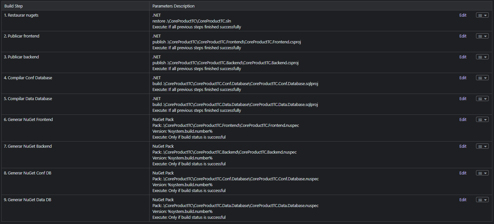

# TeamCity

En TeamCity, un pipeline se compone de **Build Steps**. En la siguiente imagen tienes una compilación básica para productos Flexygo Core .NET.

## Build Steps



A continuación se describe cada paso con los comandos equivalentes y las opciones recomendadas.

!!! note "Nombres de proyecto"
    Los nombres de proyecto (`Backend.csproj`, `Backend.Tests.csproj`) son ejemplos genéricos. Sustitúyelos por los nombres reales de los archivos `.csproj` de tu solución.

### Paso 1: Restore

**Runner type:** Command Line

```bash
dotnet restore src/Backend/Backend.csproj
```

### Paso 2: Build

**Runner type:** Command Line

```bash
dotnet build src/Backend/Backend.csproj --configuration Release --no-restore
```

### Paso 3: Test

**Runner type:** Command Line

```bash
dotnet test src/Backend/Backend.Tests.csproj --configuration Release --no-build --logger "trx;LogFileName=test-results.trx"
```

### Paso 4: Publish

**Runner type:** Command Line

```bash
dotnet publish src/Backend/Backend.csproj --configuration Release --output %system.teamcity.build.checkoutDir%/publish
```

---

## Variables de configuración

Define las siguientes variables en **Build Configuration → Parameters**:

| Variable | Descripción | Ejemplo |
|---|---|---|
| `env.ASPNETCORE_ENVIRONMENT` | Entorno de ejecución | `Production` |
| `env.CONNECTION_STRING` | Cadena de conexión a la base de datos | `Server=...;Database=...` |
| `system.build.number` | Número de build (automático en TeamCity) | `1.0.{build.counter}` |

> **Seguridad:** Marca las variables de credenciales como tipo **Password** en TeamCity para que se enmascaren en los logs de build.

---

## Configuración del NuGet feed corporativo

Si tu proyecto consume paquetes NuGet de un feed corporativo (Artifactory, Azure Artifacts, TeamCity NuGet Feed), añade un `nuget.config` en la raíz del repositorio:

```xml
<?xml version="1.0" encoding="utf-8"?>
<configuration>
  <packageSources>
    <add key="Corporate" value="https://tu-servidor/nuget/v3/index.json" />
    <add key="nuget.org" value="https://api.nuget.org/v3/index.json" />
  </packageSources>
</configuration>
```

TeamCity usará automáticamente este `nuget.config` en el paso de Restore. Para feeds que requieren autenticación, configura las credenciales en **Administration → Connections** (no en el archivo de configuración).

---

## Publicación de artefactos

En **Build Configuration → General → Artifact paths**, añade la siguiente regla:

```
publish/** => backend.zip
```

Esto comprime el directorio `publish/` generado por el Paso 4 y lo publica como artefacto descargable desde la interfaz de TeamCity, disponible para builds de despliegue posteriores.