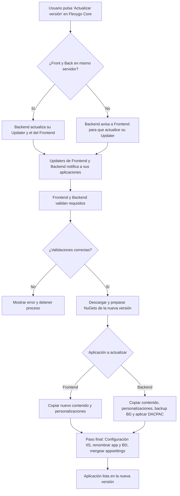

## Flujo de actualización

A continuación se muestra el flujo completo del proceso de actualización de Flexygo Core:

!!! tip "Resumen"
    Como vemos en el diagrama anterior, el proceso de actualización de Flexygo Core coordina Frontend y Backend para validar, descargar y preparar la nueva versión, realizar los backups necesarios y finalizar con la actualización de archivos, base de datos y configuración, asegurando así una actualización rápida y segura.