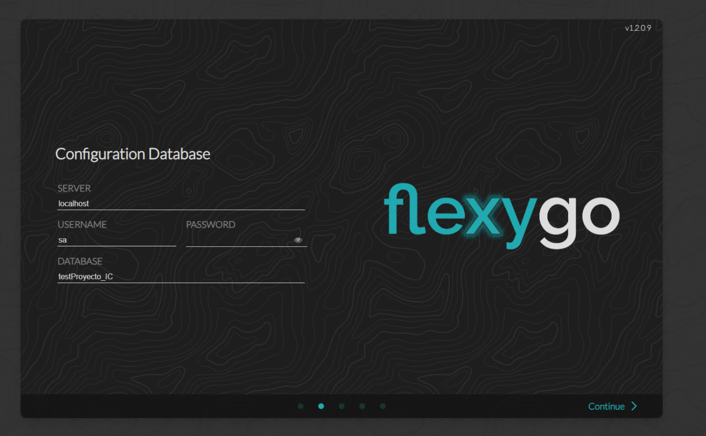
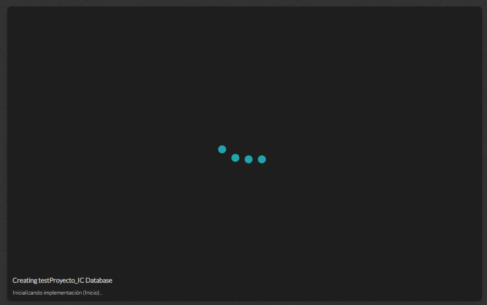
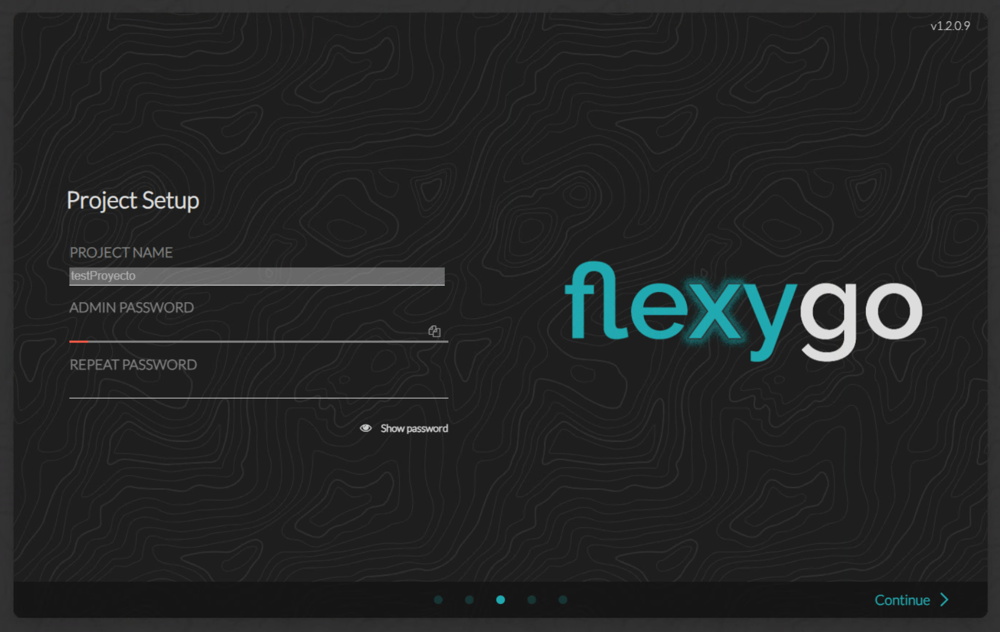
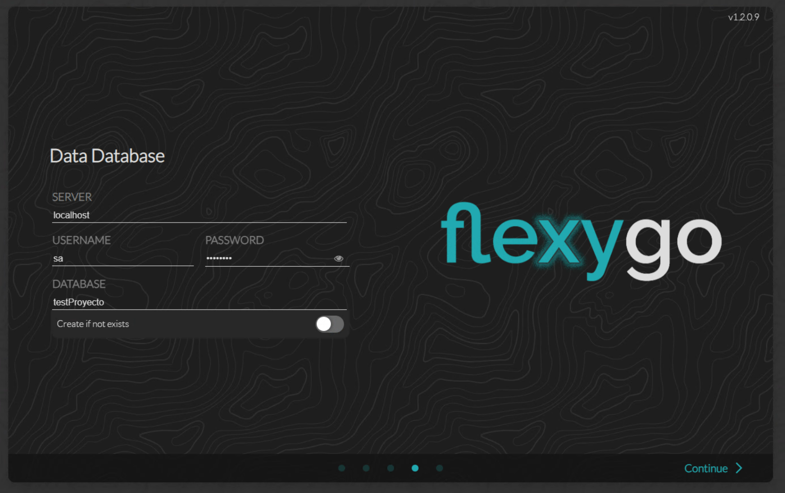
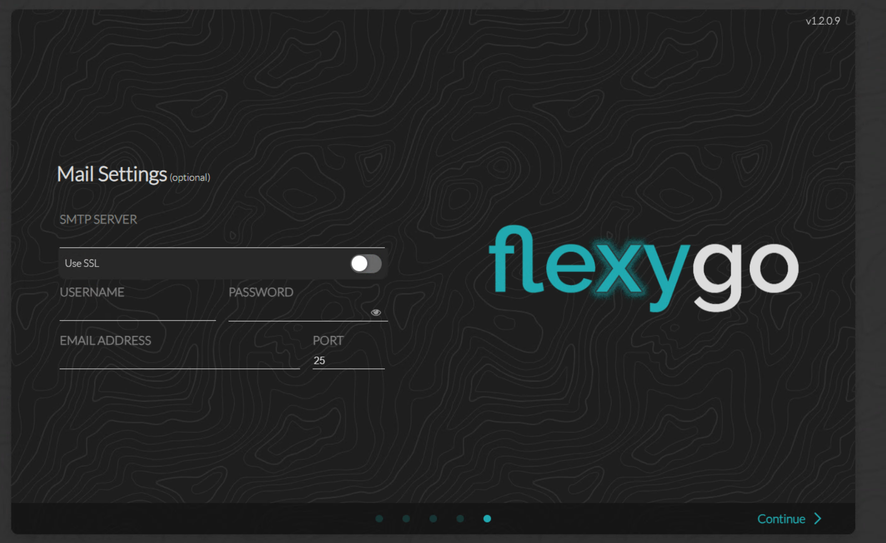
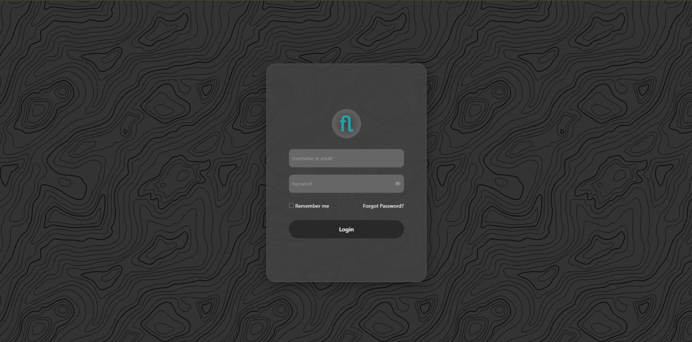

# Configuración

El Asistente de Configuración guía el proceso inicial tras la instalación: configura las bases de datos, establece la contraseña de administrador y ajusta los parámetros de correo. Todo ello actualiza `appsettings.json` automáticamente sin necesidad de editar ningún archivo.

!!! info "De web.config a appsettings.json"
    A diferencia de las aplicaciones .NET Framework donde la configuración residía en `web.config`, en Flexygo Core (basado en .NET 9) toda la configuración se gestiona a través de `appsettings.json`. El asistente se encarga de escribir y actualizar este archivo automáticamente.

---

## Asistente de configuración

El asistente se lanza automáticamente al acceder a la aplicación por primera vez.

!!! info "Versión de la aplicación"
    En la esquina superior derecha del asistente se muestra la versión actual de la aplicación instalada.

<figure markdown="span">
  
  <figcaption>Pantalla de inicio del asistente</figcaption>
</figure>

---

### 1. Configuración de la base de datos de configuración

El primer paso establece la conexión a la **base de datos de configuración**: instancia SQL, usuario, contraseña y nombre de la base de datos.

<figure markdown="span">
  
  <figcaption>Paso 1 — Datos de conexión a la BD de configuración</figcaption>
</figure>

---

### 2. Publicar la base de datos de configuración

Una vez introducida la conexión, el asistente evalúa el estado de la base de datos y actúa según la situación:

| Situación | Comportamiento |
|-----------|----------------|
| La BD ya existe y está actualizada | La usa directamente sin modificar nada |
| La BD existe pero es de una versión anterior | Aparece la opción de **actualizar** el esquema |
| La BD no existe | La crea y aplica el esquema completo |

<figure markdown="span">
  
  <figcaption>Paso 2 — Progreso de publicación de la BD de configuración</figcaption>
</figure>

---

### 3. Contraseña de administrador

Establece la contraseña del usuario administrador de la aplicación. Este usuario tiene acceso completo a la administración del sistema.

<figure markdown="span">
  
  <figcaption>Paso 3 — Contraseña del administrador</figcaption>
</figure>

---

### 4. Configuración de la base de datos de datos

El siguiente paso establece la conexión a la **base de datos de datos** (registros y contenido del producto).

<figure markdown="span">
  
  <figcaption>Paso 4 — Datos de conexión a la BD de datos</figcaption>
</figure>

Al publicar, el asistente actúa según la situación:

| Situación | Comportamiento |
|-----------|----------------|
| Existe DACPAC de datos y la BD ya existe | Usa la BD existente |
| Existe DACPAC de datos y la BD no existe | Crea la BD y aplica el DACPAC |
| No hay DACPAC de datos y la BD no existe | Crea una BD vacía |
| No hay DACPAC de datos y la BD ya existe | Usa la BD existente sin modificarla |

---

### 5. Configuración de correo

Introduce los parámetros del servidor SMTP para que la aplicación pueda enviar notificaciones.

<figure markdown="span">
  
  <figcaption>Paso 5 — Configuración del servidor de correo SMTP</figcaption>
</figure>

| Parámetro    | Descripción                                     |
|--------------|-------------------------------------------------|
| SMTP Host    | Servidor de correo (ej. `smtp.office365.com`)   |
| Puerto       | Habitualmente 587 (STARTTLS) o 465 (SSL)        |
| Usuario      | Cuenta de autenticación SMTP                    |
| Contraseña   | Contraseña de la cuenta SMTP                    |
| From Address | Dirección que aparece como remitente            |

---

### Configuración completa

Al finalizar todos los pasos, el asistente muestra la pantalla de configuración completada.

<figure markdown="span">
  
  <figcaption>Configuración finalizada</figcaption>
</figure>

Ya puedes acceder a la aplicación con las credenciales de administrador configuradas en el paso 3.

<figure markdown="span">
  
  <figcaption>Pantalla de acceso a la aplicación</figcaption>
</figure>

---

!!! note "URLs de comunicación Frontend ↔ Backend"
    El instalador configura automáticamente las URLs de comunicación entre Frontend y Backend. En instalaciones estándar no es necesario modificar nada manualmente.

!!! info "Referencia de appsettings.json"
    Para una referencia completa de las claves disponibles en `appsettings.json` y su significado, consulta [Referencia: appsettings.json](referencia-appsettings.md).

