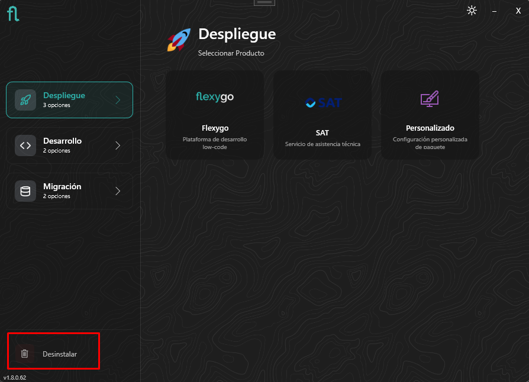
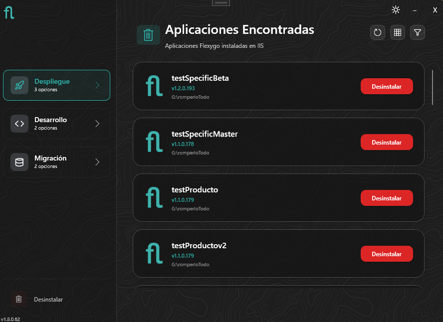
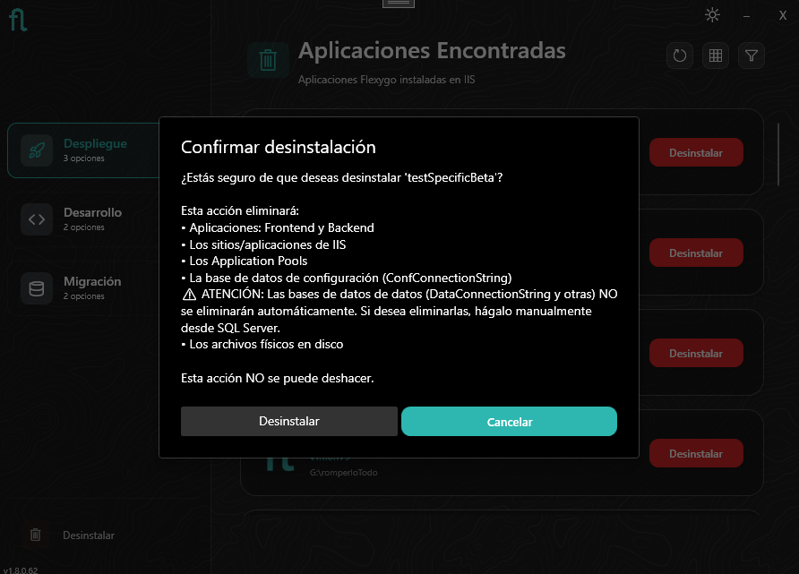
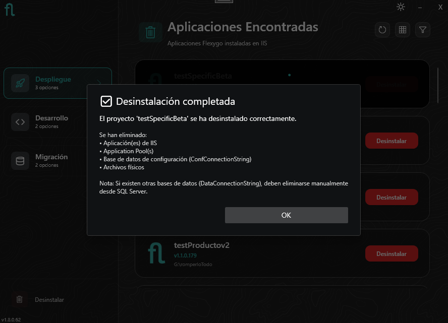

# Instalador: Modo Desinstalar

El desinstalador elimina una aplicación Flexygo Core desplegada en IIS. Se accede desde el botón **Desinstalar** en la esquina inferior izquierda de la pantalla principal del instalador.

<figure markdown="span">
  
  <figcaption>Acceso al modo Desinstalar desde la pantalla principal del instalador</figcaption>
</figure>

---

## Aplicaciones disponibles

El desinstalador detecta automáticamente todas las aplicaciones Flexygo Core instaladas en IIS y las muestra en una lista. Cada aplicación tiene su propio botón **Desinstalar**.

<figure markdown="span">
  
  <figcaption>Lista de aplicaciones Flexygo Core encontradas en IIS</figcaption>
</figure>

---

## Confirmación

Al pulsar **Desinstalar** sobre una aplicación, se muestra un diálogo de confirmación con el detalle de lo que se va a eliminar:

<figure markdown="span">
  
  <figcaption>El instalador informa exactamente qué se eliminará antes de proceder</figcaption>
</figure>

**Esta acción eliminará:**

- Aplicaciones: Frontend y Backend
- Los sitios/aplicaciones de IIS
- Los Application Pools
- La base de datos de configuración (`ConfConnectionString`)
- Los archivos físicos en disco

!!! warning "Bases de datos de datos"
    Las bases de datos de datos (`DataConnectionString` y otras) **NO se eliminan automáticamente**. Si deseas eliminarlas, hazlo manualmente desde SQL Server una vez completada la desinstalación.

!!! danger "Esta acción no se puede deshacer"
    Realiza un backup de la base de datos de datos antes de continuar si necesitas conservar los registros de la aplicación.

---

## Desinstalación completada

Al finalizar, el instalador muestra un resumen de los elementos eliminados.

<figure markdown="span">
  
  <figcaption>Confirmación de desinstalación completada con resumen de elementos eliminados</figcaption>
</figure>

!!! tip "Reinstalar tras desinstalar"
    Para reinstalar Flexygo Core en el mismo servidor, ejecuta de nuevo el instalador en modo [Despliegue](instalacion-despliegue.md).
