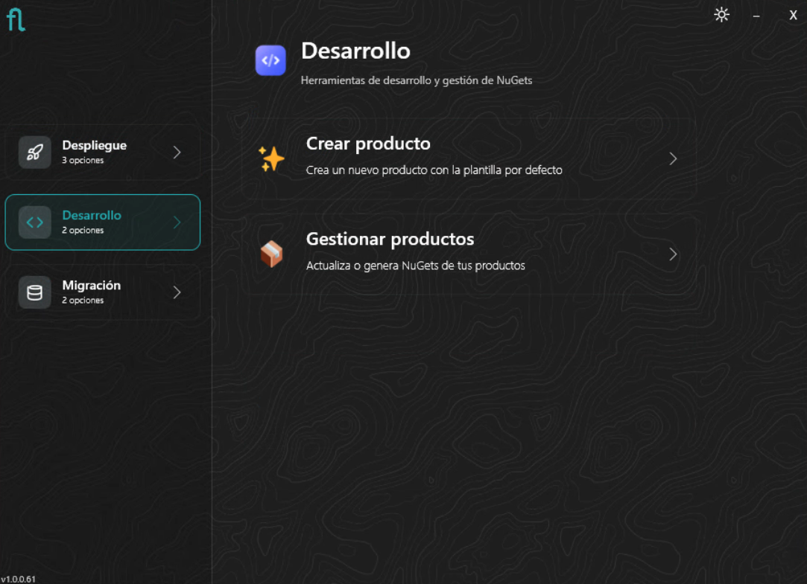
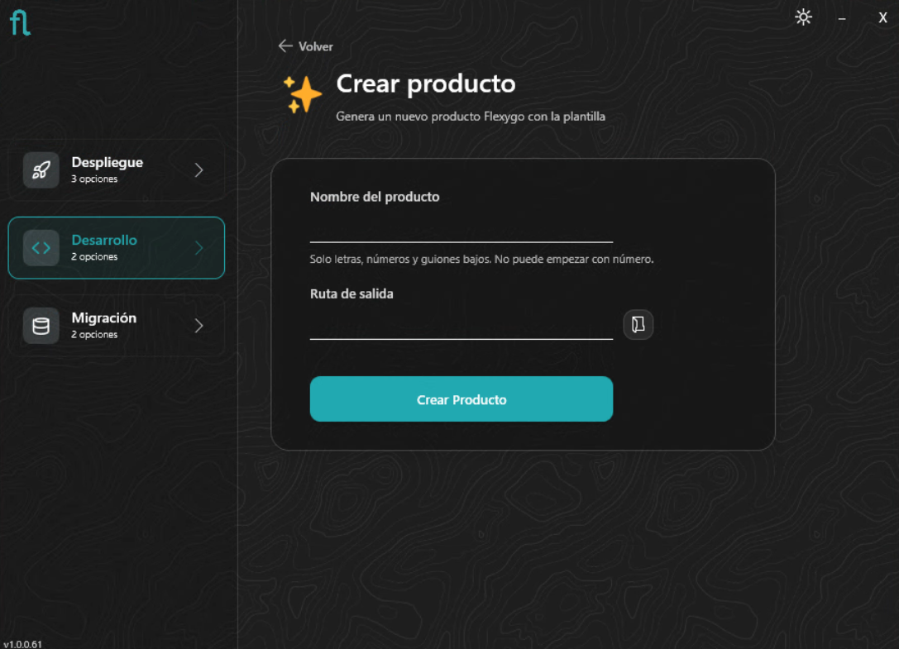
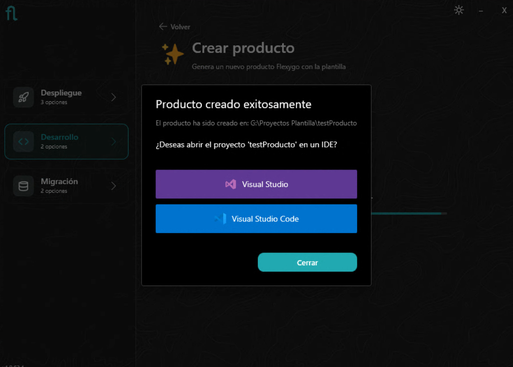
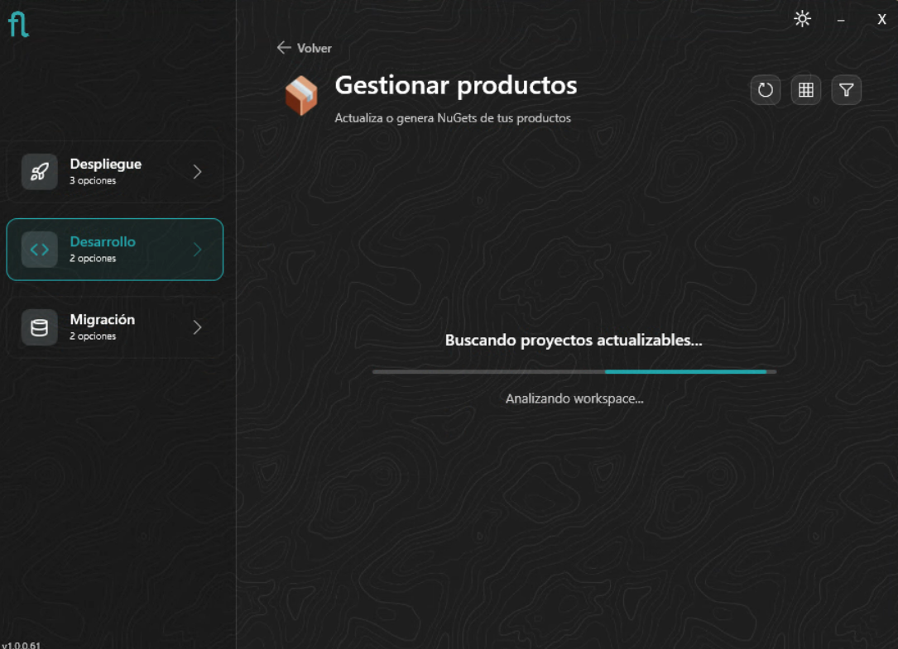
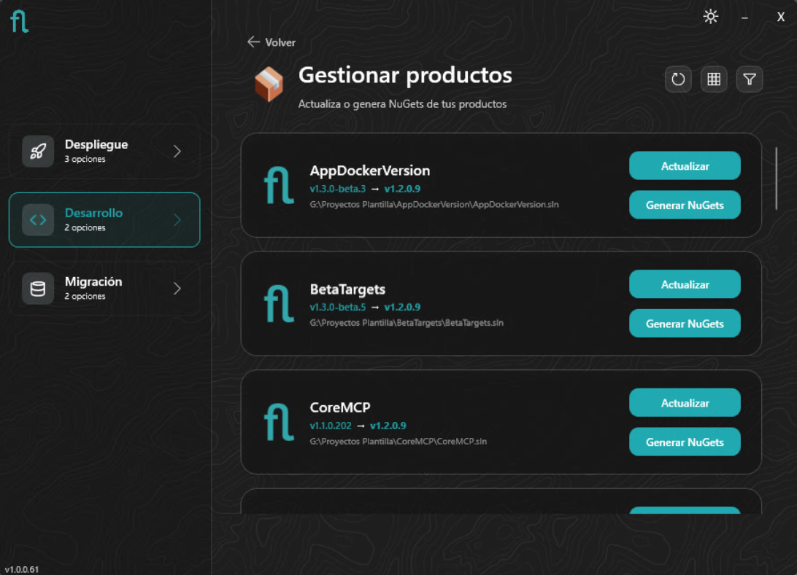
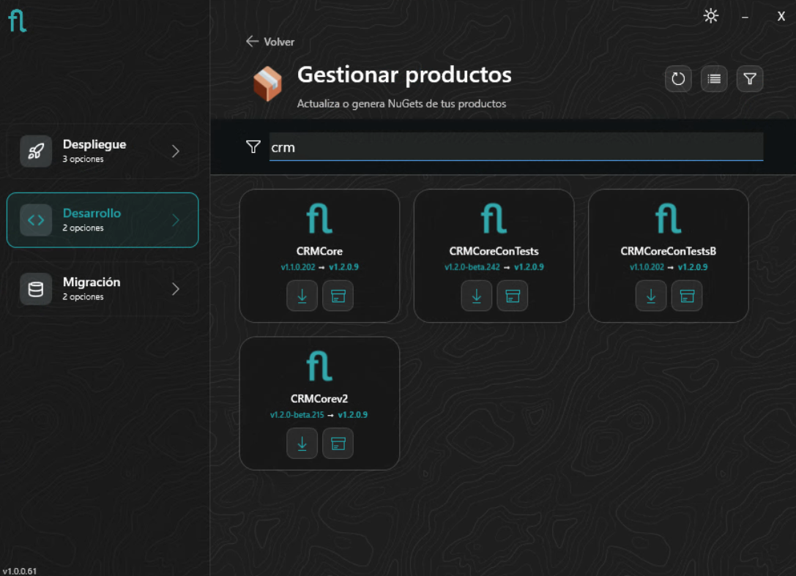
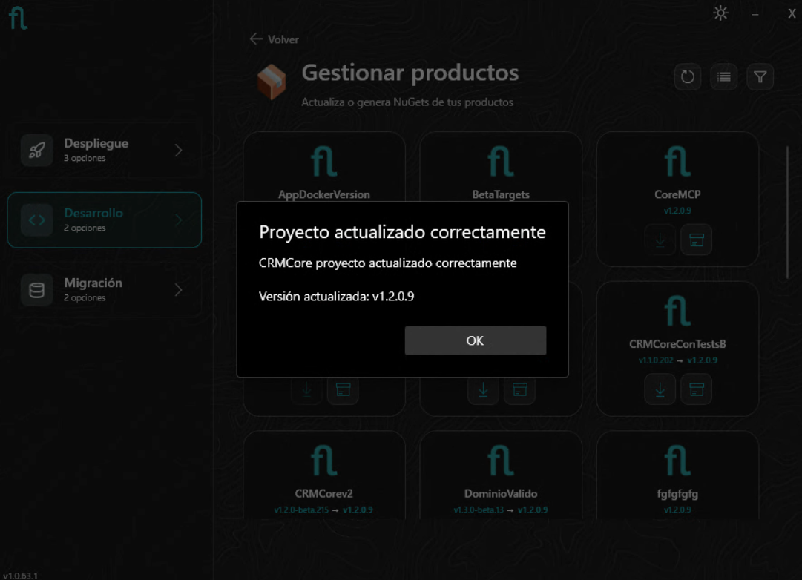
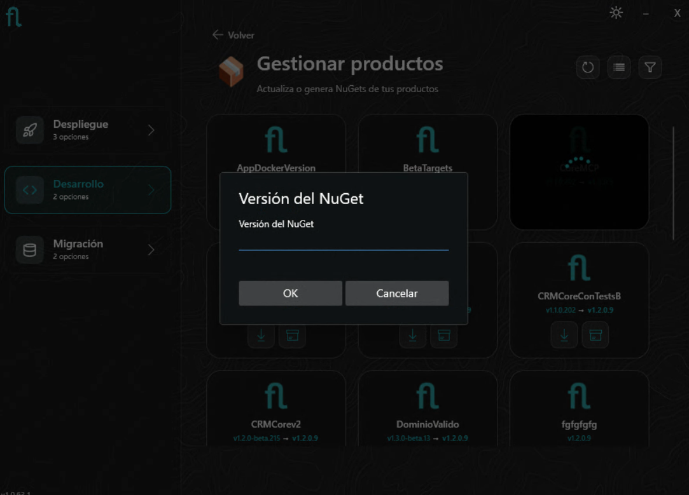

# Instalador: Modo Desarrollo

El modo **Desarrollo** del instalador está orientado a desarrolladores que trabajan con proyectos Flexygo Core en Visual Studio o VS Code. Ofrece dos operaciones: crear un nuevo producto desde la plantilla oficial, o gestionar productos ya existentes en el workspace.

!!! warning "Requisito previo para VS Code: Node.js en PATH global"
    Si vas a trabajar con el proyecto desde **VS Code**, necesitas tener **Node.js** instalado y disponible en el **PATH global** del sistema. Si no está en el PATH, la compilación del Frontend fallará. Consulta los [requisitos de desarrollo](../producto/requisitos.md).

<figure markdown="span">
  
  <figcaption>Pantalla principal: el modo Desarrollo ofrece 2 opciones</figcaption>
</figure>

---

=== "Crear producto"

    ## Crear un nuevo producto

    Esta opción genera la estructura completa de un producto Flexygo Core a partir de la plantilla oficial: proyectos Frontend, Backend y bases de datos, listos para abrir en Visual Studio o VS Code.

    <figure markdown="span">
      
      <figcaption>Formulario para crear un nuevo producto</figcaption>
    </figure>

    Introduce el nombre del producto y la ruta donde se generará el proyecto. El instalador instala la plantilla (o la actualiza si ya está instalada) e instala o actualiza también las herramientas de desarrollo:

    - **Flexygo Product Tools** — permite generar NuGets y actualizar el proyecto desde línea de comandos o desde las extensiones de Visual Studio y VS Code
    - **Flexygo MCP** — servidor MCP para integración con Copilot y otros clientes IA

    Una vez completado, crea la solución a partir de la plantilla.

    <figure markdown="span">
      
      <figcaption>Producto generado — listo para abrir en Visual Studio o VS Code</figcaption>
    </figure>

    !!! tip "Alternativa por línea de comandos"
        También puedes crear un producto usando la plantilla directamente con `dotnet new`. Consulta la guía de [Plantilla de producto](../producto/plantilla.md).

=== "Gestionar productos"

    ## Gestionar productos existentes

    Esta opción escanea el workspace en busca de proyectos Flexygo Core y permite **actualizar** la versión del Core o **generar los NuGets** del producto.

    ### Carga del workspace

    Al entrar, el instalador analiza el workspace en busca de soluciones Flexygo Core.

    <figure markdown="span">
      
      <figcaption>El instalador escanea el workspace en busca de proyectos Flexygo Core</figcaption>
    </figure>

    ### Lista de productos

    Una vez cargados, los productos aparecen mostrando la versión actual instalada y la última versión estable disponible de Flexygo. Se puede alternar entre vista de lista y cuadrícula, y filtrar por nombre.

    <figure markdown="span">
      
      <figcaption>Vista de lista: versión actual → última versión estable disponible, con acciones por producto</figcaption>
    </figure>

    <figure markdown="span">
      
      <figcaption>Vista de cuadrícula con filtro activo</figcaption>
    </figure>

    ### Actualizar versión del Core

    Pulsa **Actualizar** en el producto deseado para actualizar los paquetes NuGet del Core a la versión disponible. El instalador realiza el proceso y confirma el resultado.

    <figure markdown="span">
      
      <figcaption>Confirmación de actualización del producto a la nueva versión del Core</figcaption>
    </figure>

    !!! warning "No actualices manualmente los paquetes NuGet"
        El actualizador realiza pasos adicionales (sincronización de recursos, merge de `appsettings`…) que no ocurren con una actualización manual de NuGet desde Visual Studio o VS Code.

    ### Generar NuGets del producto

    Pulsa **Generar NuGets** para empaquetar el producto. El instalador pide la versión con la que etiquetar los paquetes generados.

    <figure markdown="span">
      
      <figcaption>Introduce la versión con la que se generarán los paquetes NuGet del producto</figcaption>
    </figure>

    Al completarse, se abre automáticamente el explorador de archivos con la carpeta donde se han generado los paquetes. Los paquetes resultantes (Frontend, Backend, Conf.Database, Data.Database) quedan disponibles para publicar en un feed NuGet o distribuir al instalador.
