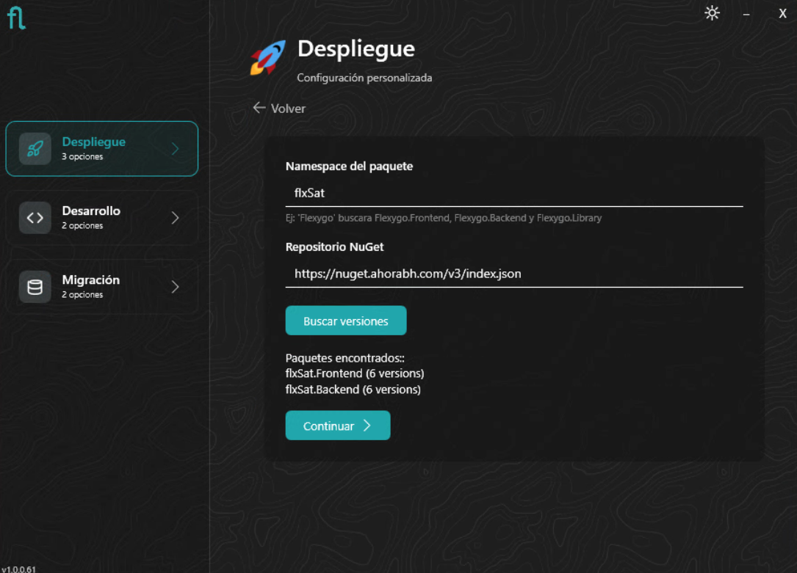
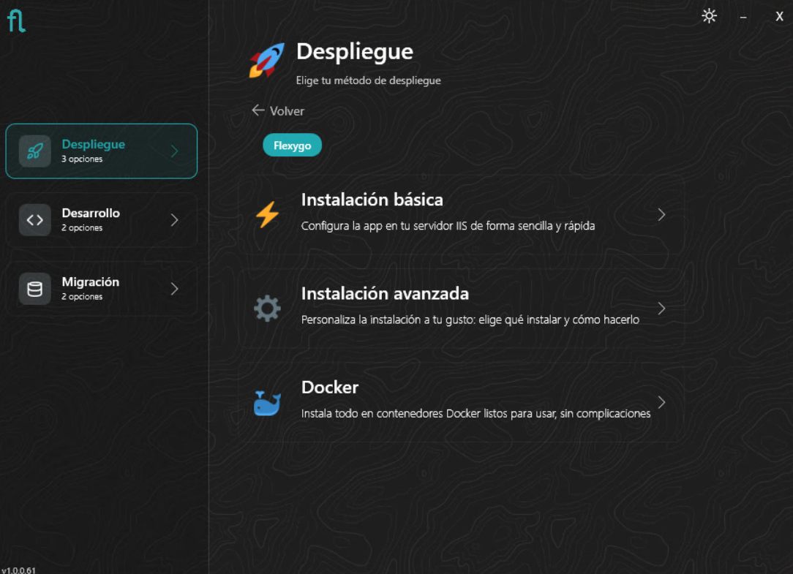
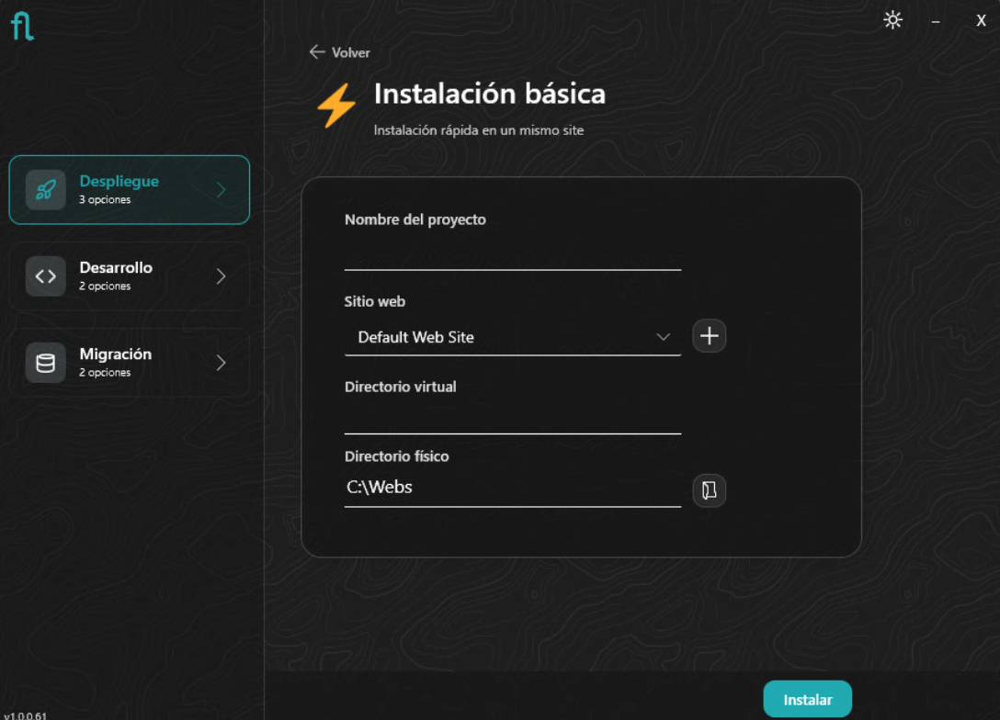
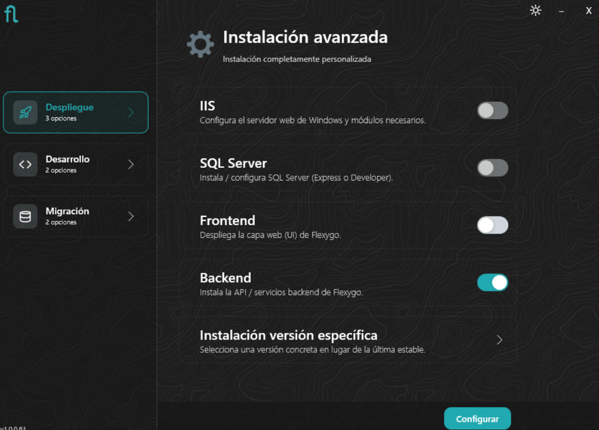
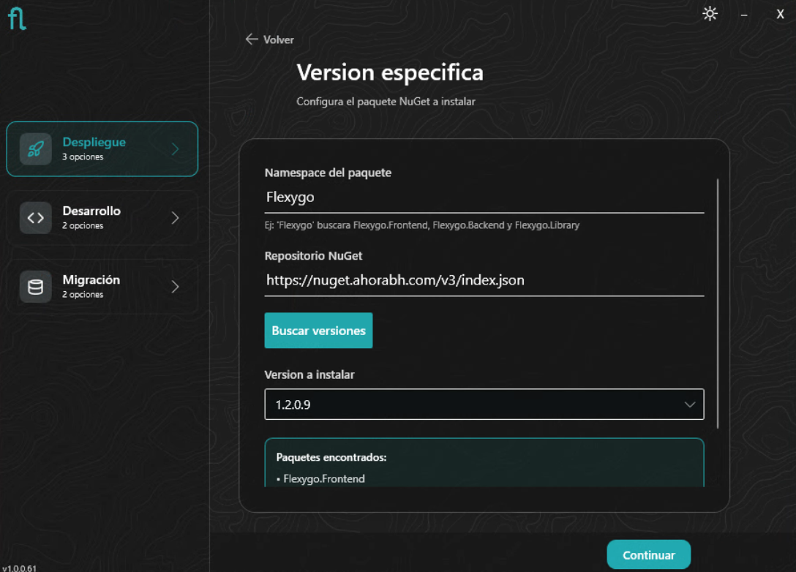
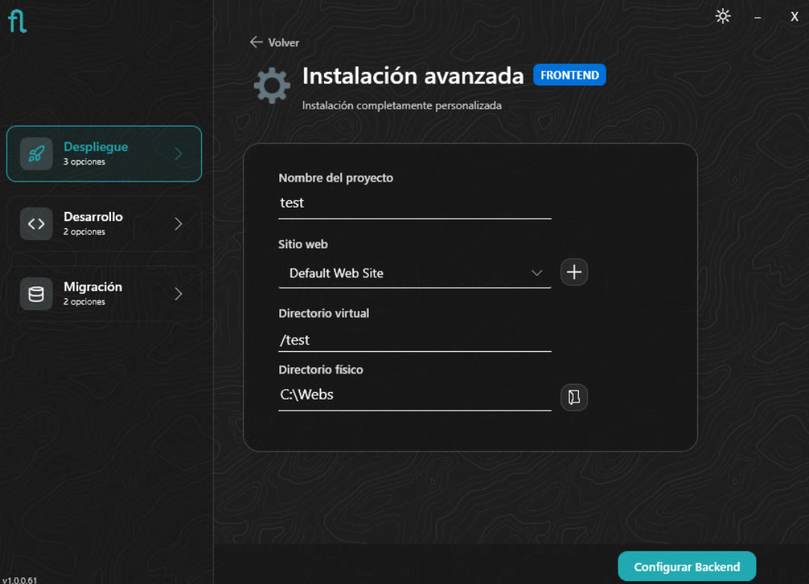
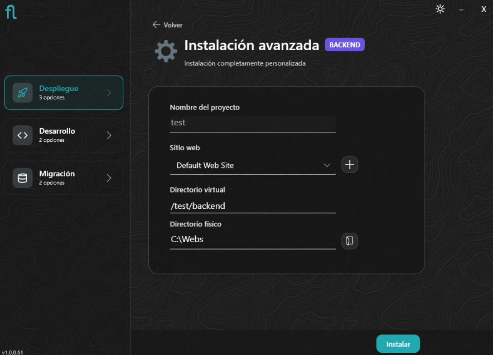
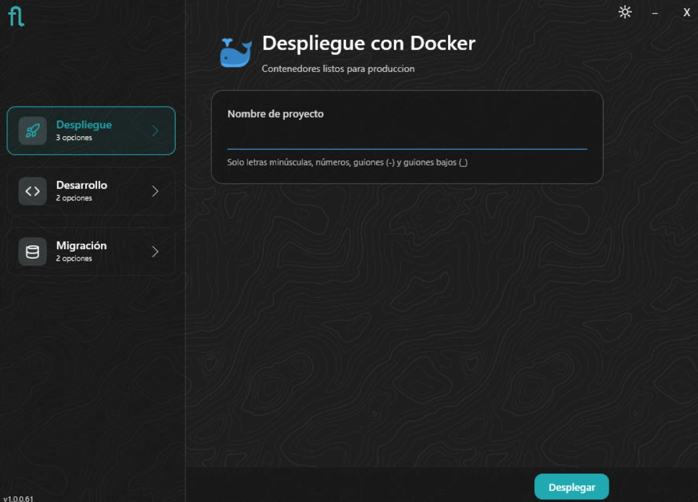
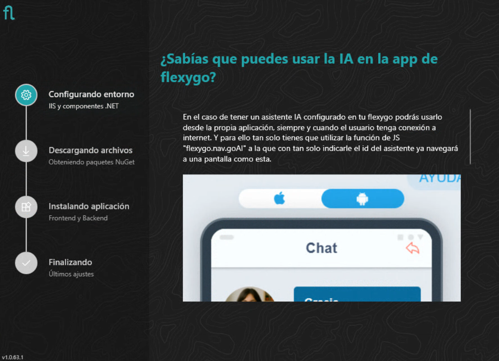
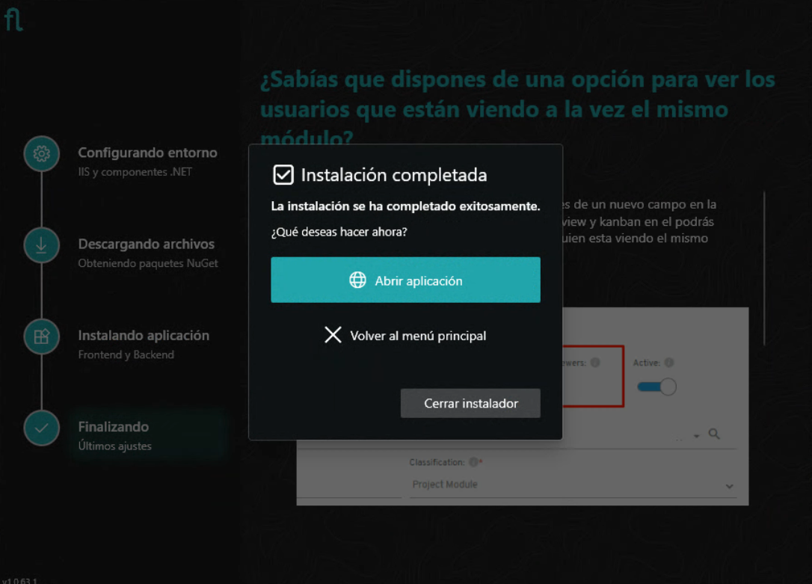

# Instalador: Modo Despliegue

El modo **Despliegue** del instalador de Flexygo Core permite configurar el entorno para producción o pre-producción.

!!! tip "Docker en producción"
    Para entornos de producción con Docker se recomienda usar la guía de [Docker](docker.md) con `docker-compose` manual, que ofrece mayor control sobre la configuración.

---

## 1. Selección de producto

El primer paso es elegir qué producto quieres instalar. El instalador muestra las soluciones disponibles (Flexygo, SAT, CRM…) y la opción **Personalizado**, que permite especificar manualmente el paquete NuGet a instalar y su origen.

Si seleccionas **Personalizado**, deberás indicar el nombre del paquete NuGet y dónde buscarlo: una URL de feed remoto o una ruta física local. El nombre del paquete debe seguir la [convención de nombres de Flexygo Core](../producto/plantilla.md#convencion-de-nombres-nuget) para que el instalador lo detecte correctamente.

---

## 2. Modo de instalación

Una vez seleccionado el producto, elige el modo de instalación según tu entorno:

=== "IIS Básico"

    ## Instalación básica

    Instala Frontend y Backend en el **mismo servidor y sitio IIS**. Ideal para pruebas, demos o entornos pequeños.

    ### Configuración del sitio
    Elige el nombre del proyecto, selecciona un sitio web existente o crea uno nuevo, establece el *path* virtual (si lo deseas) y el directorio físico donde se instalará la aplicación.

    

=== "IIS Avanzado"

    ## Instalación avanzada

    Permite instalar **Frontend y Backend en servidores distintos**, o instalar solo uno de los dos componentes. Adecuada para instalaciones personalizadas en producción.

    ### Selección de componentes
    Elige si instalar solo **Frontend**, solo **Backend**, o ambos. También puedes instalar IIS y/o SQL Server si tu entorno aún no los tiene, y optar por instalar una versión específica del producto.

    

    ### Versión específica
    Si seleccionaste instalar una versión específica, indica el nombre del paquete y su origen (URL de feed remoto o ruta física). El asistente buscará las versiones disponibles para que elijas la que necesitas.

    

    ### Configuración de Frontend
    Elige el nombre del proyecto, sitio IIS, *path* virtual y directorio físico donde se instalará el Frontend.

    

    ### Configuración de Backend
    Elige el nombre del proyecto, sitio IIS, *path* virtual y directorio físico donde se instalará el Backend.

    

=== "Docker (vía Installer)"

    ## Instalación Docker

    Despliega Flexygo Core directamente sobre **Docker Desktop**. Orientado a entornos de demo, pruebas o desarrollo local con contenedores.

    !!! info "Requisito previo"
        Asegúrate de tener **Docker Desktop** instalado y en ejecución antes de continuar.
        Puedes descargarlo desde [docker.com/products/docker-desktop](https://www.docker.com/products/docker-desktop/).

    ### Configuración del despliegue Docker
    Configura los parámetros del contenedor: puertos, volúmenes y opciones de despliegue para Frontend y Backend.

    

    !!! tip "Resultado"
        Una vez confirmada la configuración, el instalador levanta los contenedores directamente en Docker Desktop. Puedes acceder a la aplicación desde el propio Docker Desktop o mediante el puerto configurado.

---

## 3. Progreso y finalización

*(Solo modos IIS Básico e IIS Avanzado)*

Verás el progreso de la instalación paso a paso. Una vez finalizada, el asistente muestra un resumen y ofrece abrir la aplicación directamente en el navegador.

