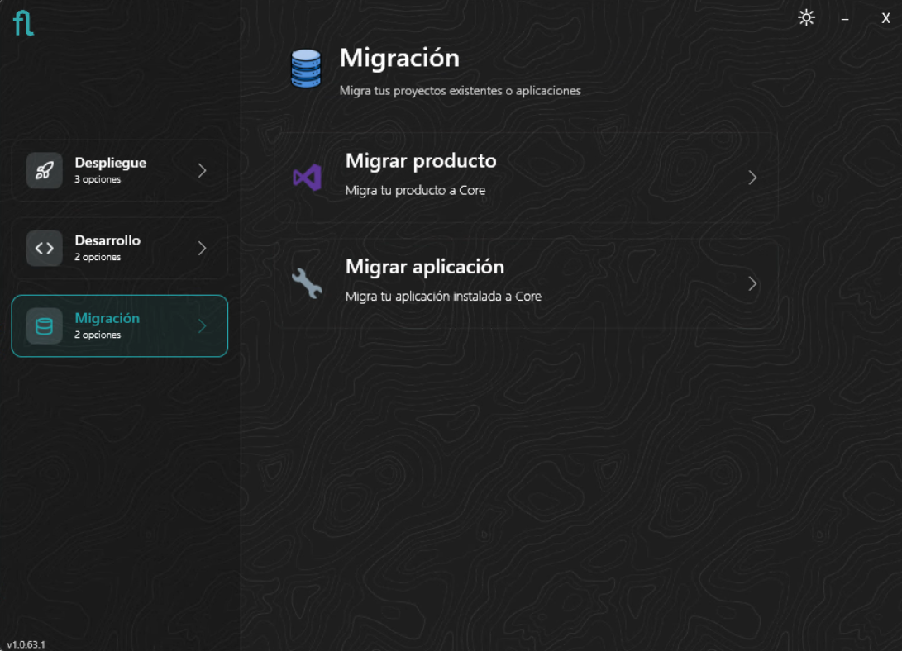
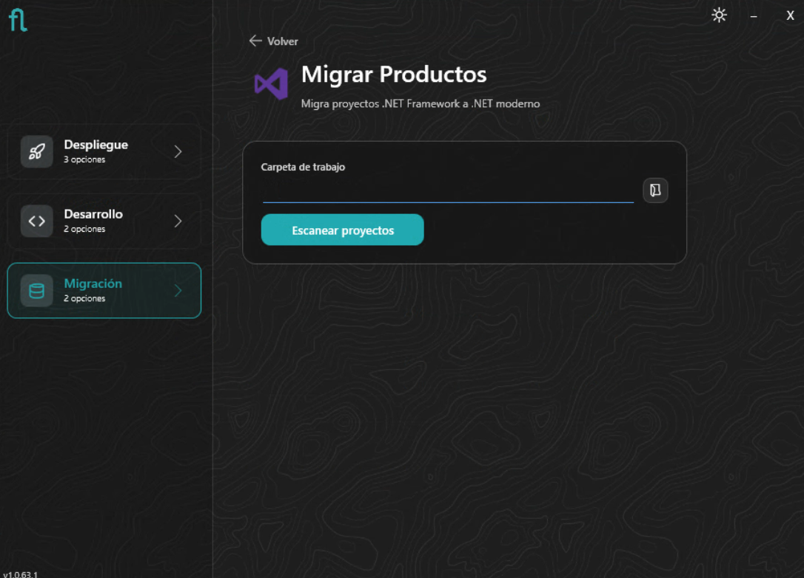
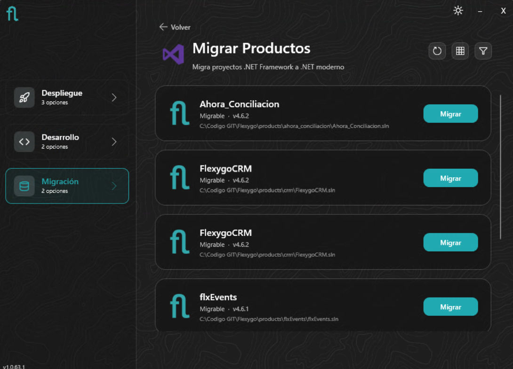
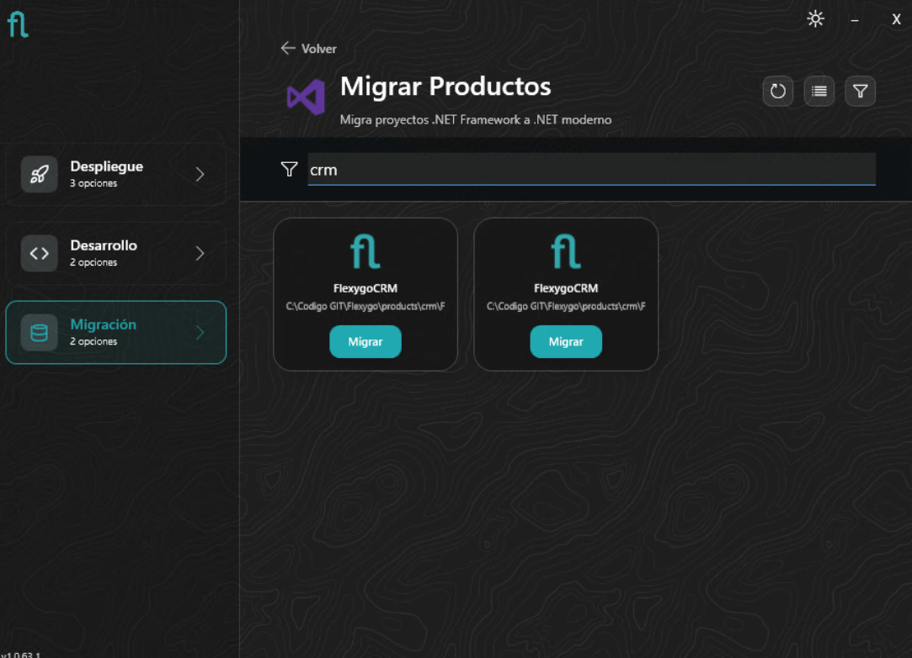
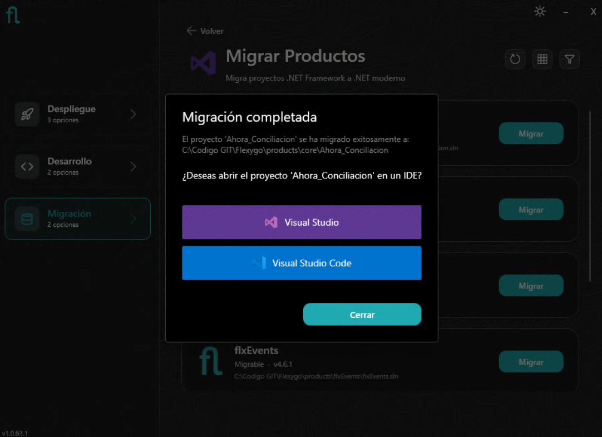
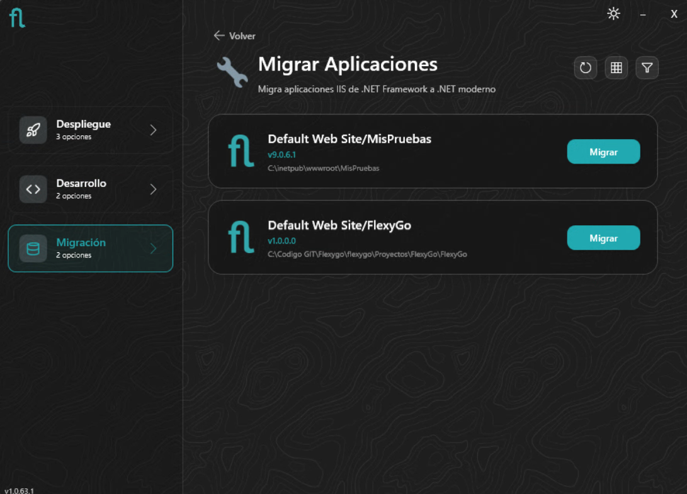
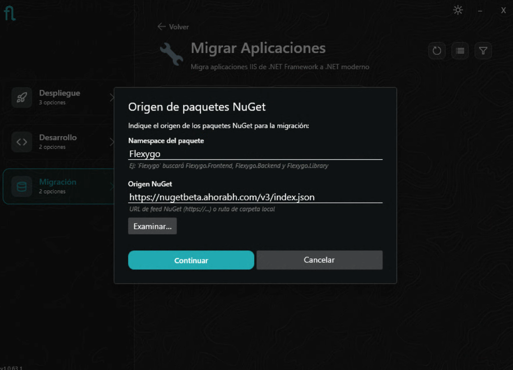
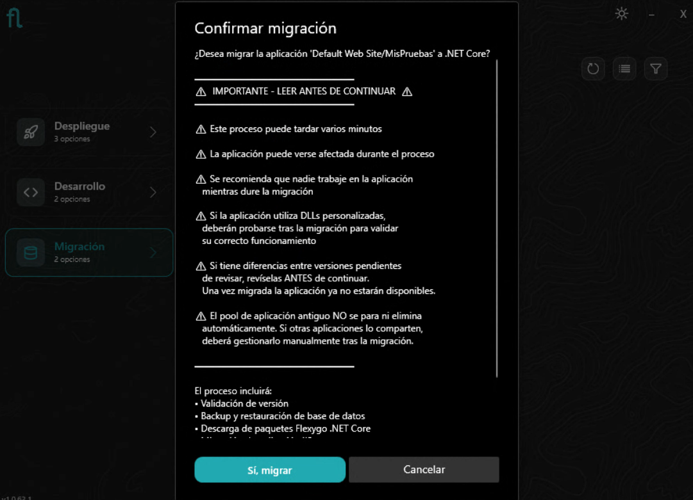
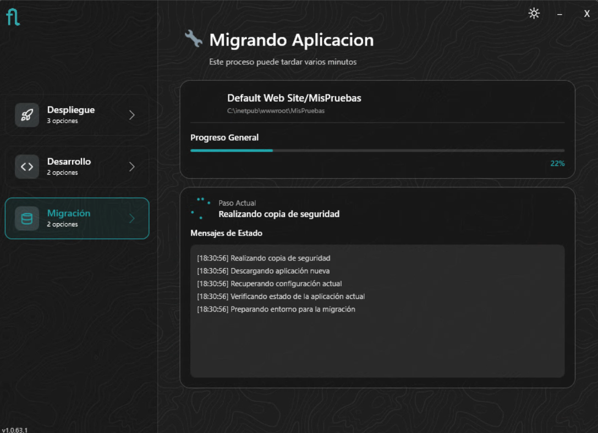
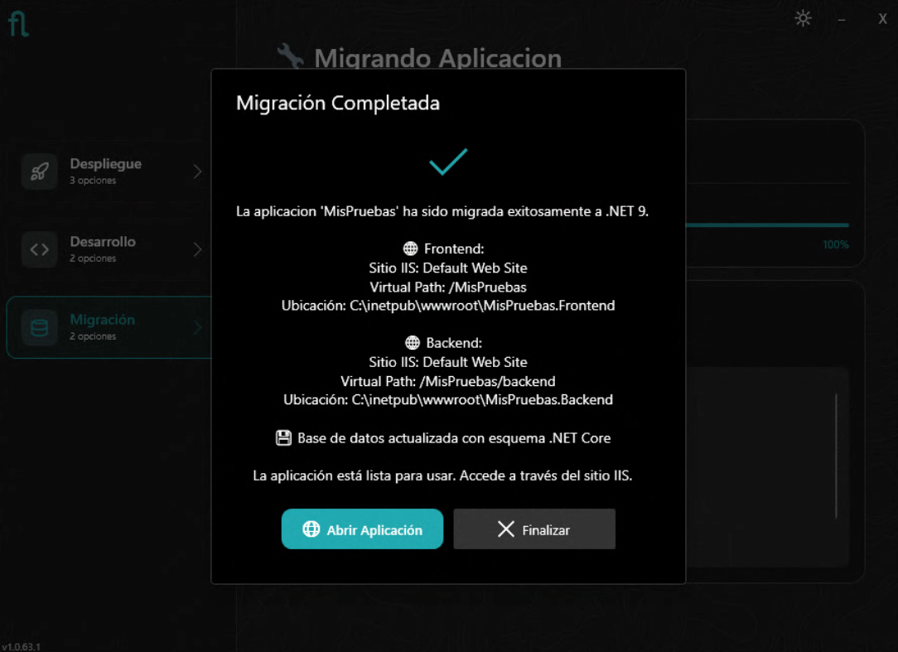

# Instalador: Modo Migración

El modo **Migración** del instalador permite trasladar proyectos y aplicaciones de .NET Framework a .NET Core (Flexygo Core). Ofrece dos variantes según el punto de partida.

<figure markdown="span">
  
  <figcaption>El modo Migración ofrece 2 opciones</figcaption>
</figure>

---

=== "Migrar Productos"

    ## Migrar proyectos de código

    Esta opción escanea el workspace en busca de soluciones .NET Framework de Flexygo y permite migrarlas a la estructura de Flexygo Core (.NET moderno).

    ### Carga del workspace

    Indica la **carpeta de trabajo** donde se encuentran los proyectos y pulsa **Escanear proyectos**. El instalador analizará el workspace en busca de soluciones .NET Framework de Flexygo.

    <figure markdown="span">
      
      <figcaption>Especifica la carpeta de trabajo y pulsa Escanear proyectos</figcaption>
    </figure>

    ### Lista de productos

    Los proyectos encontrados se muestran con su versión actual. Se puede alternar entre vista de lista y cuadrícula, y filtrar por nombre.

    <figure markdown="span">
      
      <figcaption>Vista de lista con los proyectos disponibles para migrar</figcaption>
    </figure>

    <figure markdown="span">
      
      <figcaption>Vista de cuadrícula con filtro activo</figcaption>
    </figure>

    ### Migrar

    Pulsa **Migrar** en el proyecto deseado. El instalador genera la nueva estructura de Flexygo Core a partir del proyecto existente.

    ### Migración completada

    Al finalizar, el instalador ofrece abrir el proyecto migrado directamente en Visual Studio o VS Code.

    <figure markdown="span">
      
      <figcaption>El proyecto migrado puede abrirse directamente en Visual Studio o VS Code</figcaption>
    </figure>

    !!! warning "Revisiones necesarias tras migrar el proyecto"
        Antes de compilar y probar el proyecto migrado, revisa los siguientes puntos:

        **Conf.Database**

        - Abre el proyecto `Conf.Database` y revisa el fichero de configuración y la integridad del script **postdeploy** migrado.
        - Revisa también los scripts de **staticdata** para asegurarte de que se han migrado correctamente y no contienen referencias obsoletas.
        - Verifica también el fichero **config.sql** y comprueba su integridad. El migrador reemplaza automáticamente `AutoUpdatePackageId` por `AutoUpdatePackageNamespace` en este fichero, pero si tienes este valor configurado en algún otro script deberás reemplazarlo manualmente.

        **Carpetas de artefactos antiguos**

        Elimina manualmente las carpetas `Properties`, `obj` y `debug` que puedan haber quedado de la solución anterior en los proyectos **Frontend**, **Backend** y **Processes** (si existe). Estas carpetas pueden contener assemblies de .NET Framework incompatibles con la nueva solución. Se volverán a generar correctamente al compilar.

        **Namespaces obsoletos en Processes**

        Si los Processes están escritos en C#, es posible que hagan uso de namespaces que ya no existen en .NET moderno. Los casos más habituales son:

        | Namespace .NET Framework | Equivalente en .NET |
        |--------------------------|---------------------|
        | `System.Web` | `Microsoft.AspNetCore.Http` |
        | `System.Web.HttpContext` | `Microsoft.AspNetCore.Http.HttpContext` |
        | `System.Web.HttpRequest` | `Microsoft.AspNetCore.Http.HttpRequest` |
        | `System.Web.HttpResponse` | `Microsoft.AspNetCore.Http.HttpResponse` |
        | `System.Web.HttpServerUtility` | `Microsoft.AspNetCore.Hosting.IWebHostEnvironment` |
        | `System.Web.SessionState` | `Microsoft.AspNetCore.Http.ISession` |

        Revisa los `using` de cada Process y sustituye los obsoletos por sus equivalentes. Si hay casos no contemplados en la tabla, consulta la [guía oficial de migración de ASP.NET a ASP.NET Core](https://learn.microsoft.com/es-es/aspnet/core/migration/proper-to-2x/).

=== "Migrar Aplicaciones"

    ## Migrar aplicaciones IIS

    Esta opción detecta las aplicaciones Flexygo de .NET Framework desplegadas en IIS y las migra a .NET Core en su lugar.

    ### Aplicaciones encontradas

    El instalador lista las aplicaciones IIS de Flexygo Framework detectadas en el sistema.

    <figure markdown="span">
      
      <figcaption>Aplicaciones Flexygo Framework encontradas en IIS</figcaption>
    </figure>

    ### Origen de paquetes NuGet

    Antes de iniciar, el instalador solicita el namespace del producto y la URL del feed NuGet desde donde descargará los paquetes correspondientes a la aplicación que se pretenda migrar.

    <figure markdown="span">
      
      <figcaption>Indica el namespace del producto y el feed NuGet origen</figcaption>
    </figure>

    ### Confirmación — Leer antes de continuar

    El instalador muestra un diálogo de confirmación con advertencias importantes:

    <figure markdown="span">
      
      <figcaption>Advertencias importantes antes de iniciar la migración</figcaption>
    </figure>

    !!! warning "Antes de confirmar, ten en cuenta:"
        - El proceso **puede tardar varios minutos**
        - La aplicación **puede verse afectada** durante el proceso — se recomienda que nadie trabaje en ella mientras dure la migración
        - Si la aplicación utiliza **DLLs personalizadas**, deberán probarse tras la migración para validar su correcto funcionamiento
        - Si tienes **diferencias entre versiones pendientes** de revisar, hazlo **antes** de continuar — una vez migrada la aplicación ya no estarán disponibles
        - El **Application Pool antiguo NO se para ni elimina** automáticamente — si otras aplicaciones lo comparten, deberás gestionarlo manualmente tras la migración

    El proceso incluirá: validación de versión, backup y restauración de base de datos, descarga de paquetes Flexygo .NET Core y actualización de la aplicación IIS.

    ### Progreso

    <figure markdown="span">
      
      <figcaption>El instalador muestra el progreso paso a paso, incluyendo la copia de seguridad</figcaption>
    </figure>

    !!! info "Rollback automático en caso de error"
        Si se produce un error en cualquier punto del proceso, el instalador realiza un **rollback automático** y deja el sistema exactamente en el estado original. En ningún momento se elimina ni modifica nada de lo existente:

        - Las **carpetas de la aplicación** se renombran como `OLD_<timestamp>` — las originales permanecen intactas.
        - La **base de datos de configuración** se renombra igualmente como `OLD_<timestamp>`.
        - Si existe **base de datos de datos**, también se renombra.

        Siempre es posible retornar al estado anterior manualmente restaurando las carpetas y bases de datos renombradas.

    ### Migración completada

    Al finalizar, el instalador muestra un resumen con los sitios IIS creados (Frontend y Backend) y sus rutas físicas, confirma que la base de datos ha sido actualizada al esquema .NET Core, y ofrece abrir la aplicación directamente.

    <figure markdown="span">
      
      <figcaption>Resumen de la migración: sitios IIS creados, BD actualizada, acceso directo a la aplicación</figcaption>
    </figure>

    !!! warning "Acciones necesarias tras la migración"
        - **Licencia regenerada** — la licencia se regenera automáticamente para mantener la misma licencia ya existente bajo la nueva tecnología. No es necesaria ninguna acción adicional.
        - **Todos los usuarios deberán iniciar sesión de nuevo** — la migración invalida las sesiones activas.
        - **Recarga de caché del navegador recomendada** — al mantenerse el mismo site e IIS puede que el navegador sirva archivos estáticos anteriores. Recarga con `Ctrl + Shift + R` o limpia la caché antes de usar la aplicación.

    !!! tip "Siguientes pasos"
        El ciclo de despliegue y actualización es idéntico al de cualquier instalación Flexygo Core. Consulta las guías de [Despliegue](instalacion-despliegue.md) y [Actualización](actualizador.md) para los siguientes pasos.

<!-- MIG-01, MIG-02, MIG-03 -->
