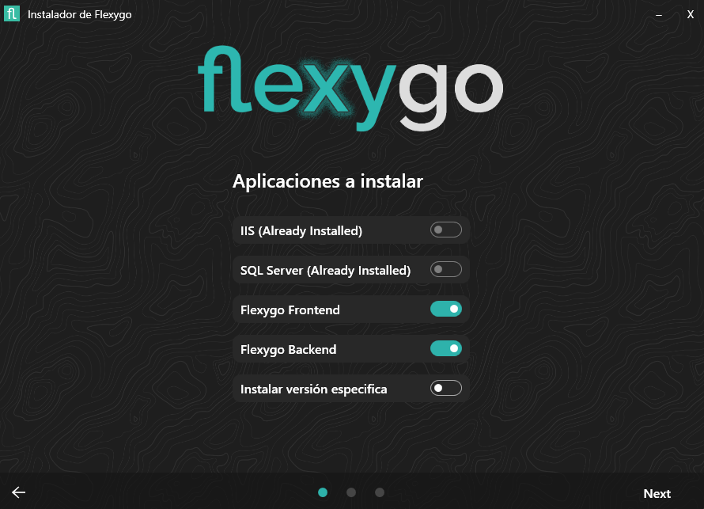
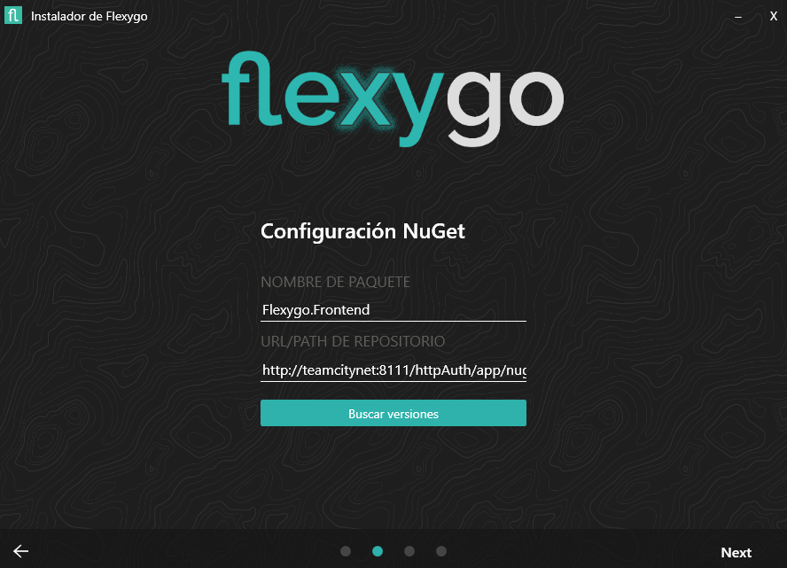
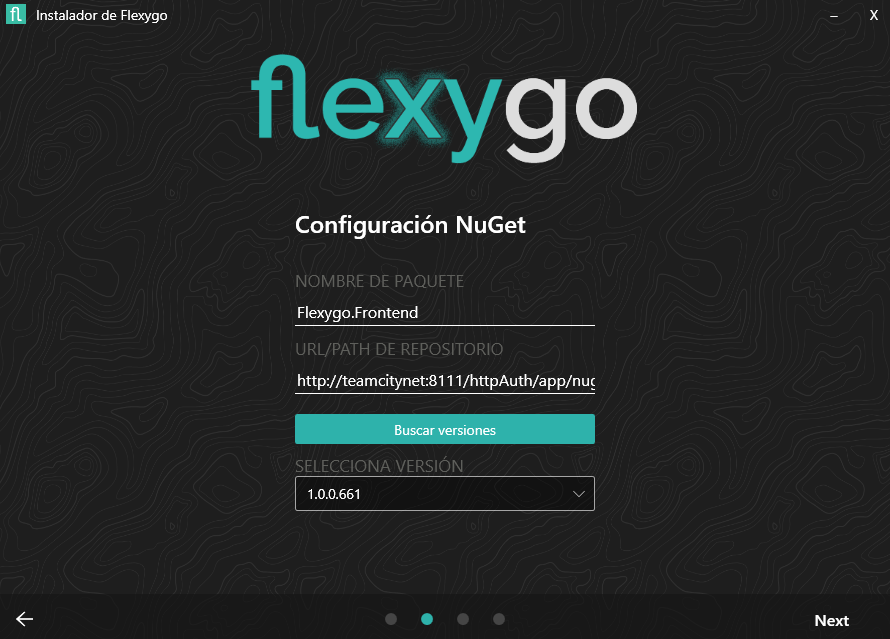
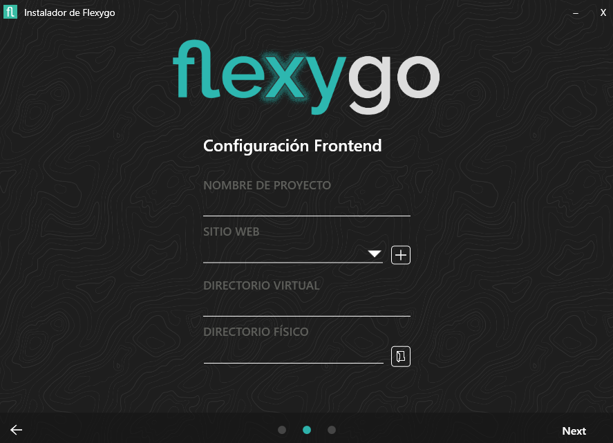
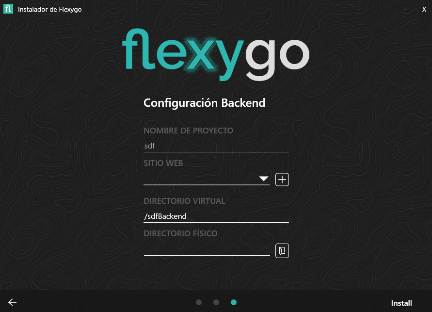

## Instalación avanzada

En la **instalación avanzada**, el asistente ofrece más opciones para adaptarse a instalaciones personalizadas o distribuidas:

### 1. Selección de componentes
   Igual que en la básica, puedes instalar IIS y/o SQL Server si lo necesitas. Además, puedes elegir instalar solo **Frontend** o solo **Backend** (o ambos), lo que permite distribuir los componentes en servidores distintos, así como instalar una versión específica.
    
### 2. Instalar versión específica
   En caso de haber seleccionado la opción de instalar una versión específica tendremos la siguiente pantalla para establecer el nombre del paquete a instalar y donde buscarlo, ya sea en remoto a una URL o una ruta física.
     
   Una vez rellanada la información necesaria y le demos a **Buscar versiones**, nos aparece un desplegable para elegir la versión a instalar.
    
### 3. Configuración de Frontend
   En el siguiente paso puedes elegir el nombre del proyecto, seleccionar un sitio web existente o crear uno nuevo, establecer el *path* virtual (si lo deseas) y el directorio físico donde se instalará el Frontend.
    
### 4. Configuración de Backend 
   En el siguiente paso puedes elegir el nombre del proyecto, seleccionar un sitio web existente o crear uno nuevo, establecer el *path* virtual (si lo deseas) y el directorio físico donde se instalará el Backend.
    
### 5. Progreso 
   Finalmente, verás el progreso de la instalación paso a paso, una vez termine se abrirá el navegador con la aplicación instalada.
   