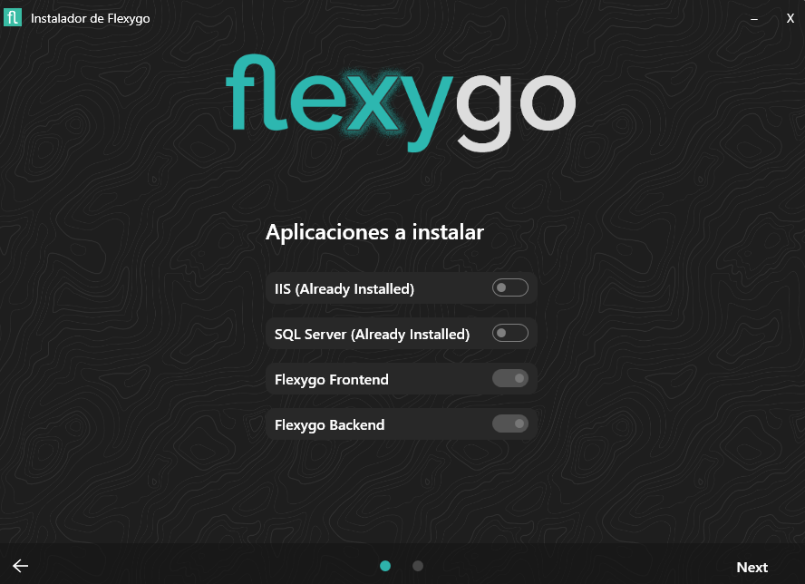
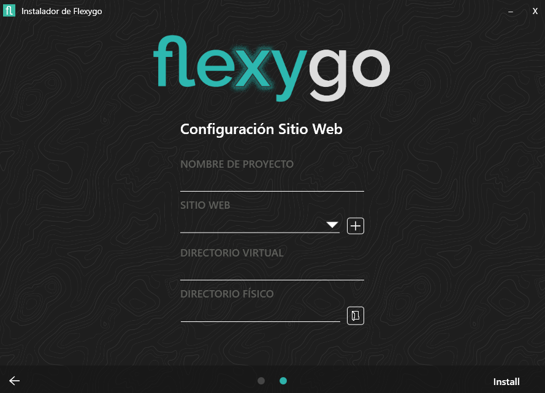
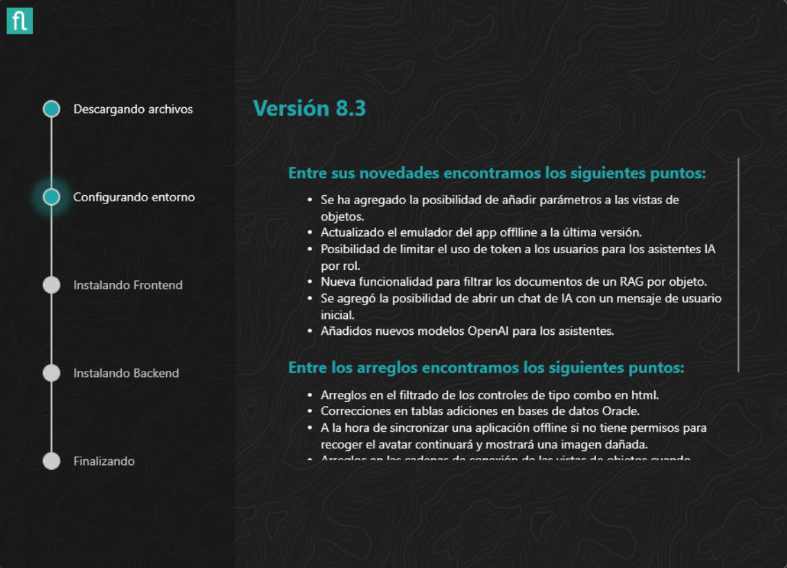

## Instalación básica

Una vez seleccionada la **instalación básica**, el asistente te guía por estos pasos:

### 1. Selección de componentes
   En el primer paso puedes seleccionar instalar IIS y/o SQL Server si tu entorno aún no los tiene.  
    

### 2. Configuración del sitio
   En el siguiente paso puedes elegir el nombre del proyecto, seleccionar un sitio web existente o crear uno nuevo, establecer el *path* virtual (si lo deseas) y el directorio físico donde se instalará la aplicación.  
    

### 3. Progreso
   Finalmente, verás el progreso de la instalación paso a paso, una vez termine se abrirá el navegador con la aplicación instalada.
     