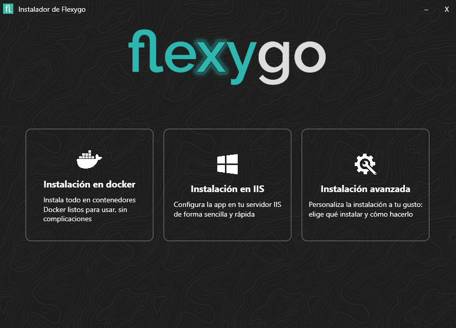

## Instalador de Flexygo Core

El instalador de Flexygo Core te guía para desplegar tu aplicación de la forma más adecuada a tus necesidades. Puedes elegir entre tres métodos principales:

- **[Instalación IIS](instalacionbasica.md):**  
  Todo se instala automáticamente en un único servidor y sitio IIS. Ideal para pruebas, demos o entornos pequeños.

- **[Instalación Avanzada](instalacionavanzada.md):**  
  Permite configurar varios sitios IIS e instalación parcial para múltiples servidores. Para instalaciones personalizadas en producción.

- **[Instalación Docker](instalaciondocker.md):**  
  Genera los archivos y configuraciones necesarios para desplegar la aplicación usando contenedores Docker.

   
