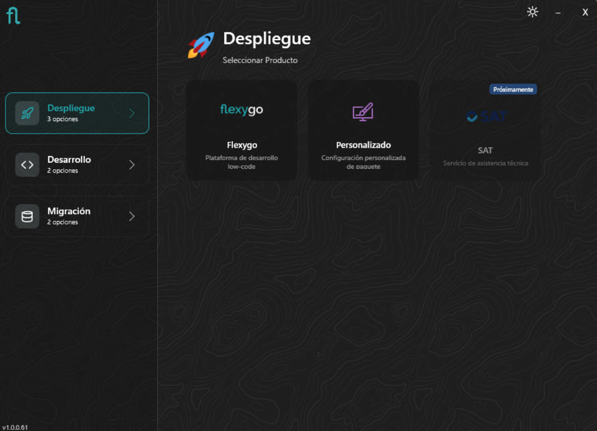
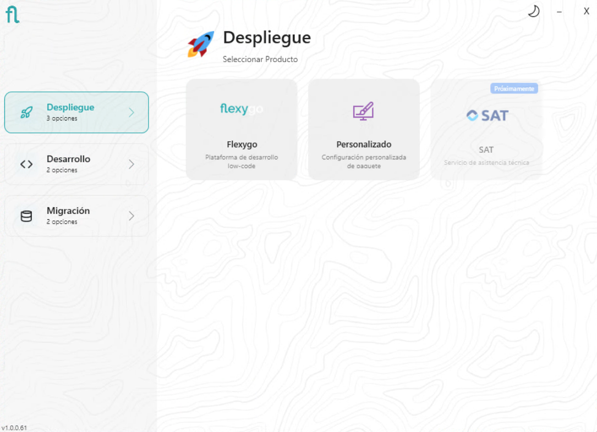

# Instalador de Flexygo Core

El instalador de Flexygo Core es la herramienta principal para gestionar el ciclo de vida completo de una instalación: desde el despliegue inicial hasta la migración desde versiones anteriores o la desinstalación.

<figure markdown="span">
  
  <figcaption>Pantalla de inicio del instalador (modo oscuro)</figcaption>
</figure>

<figure markdown="span">
  
  <figcaption>Pantalla de inicio del instalador (modo claro)</figcaption>
</figure>

## Modos disponibles

El instalador cubre los siguientes escenarios:

- **[Despliegue](instalacion-despliegue.md)** — Instalación en un entorno de producción o pre-producción. Disponible en tres variantes: IIS básico (sitio único compartido), IIS avanzado (sitios independientes por componente) y Docker vía installer.

- **[Desarrollo](instalacion-desarrollo.md)** — Instalación orientada a entornos locales de desarrollo, con opciones específicas para trabajar con el código fuente.

- **[Migración](instalacion-migracion.md)** — Migración de proyectos o aplicaciones existentes de .NET Framework a Flexygo Core (.NET moderno).

- **[Desinstalar](desinstalar.md)** — Eliminación limpia de una instalación existente, incluyendo sitios IIS y bases de datos asociadas.
