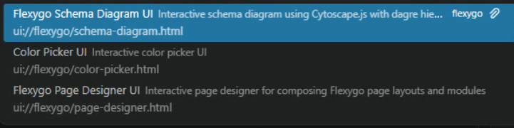
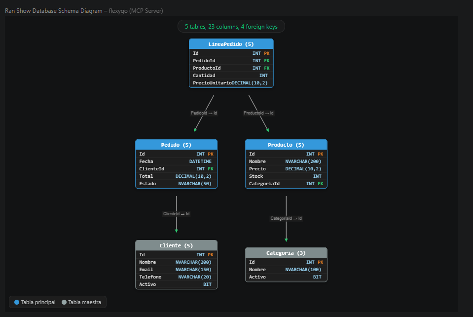
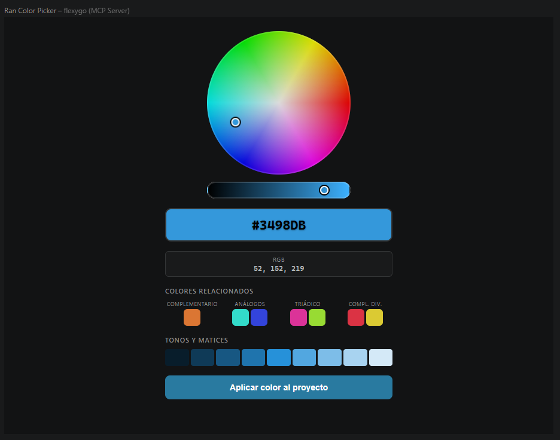
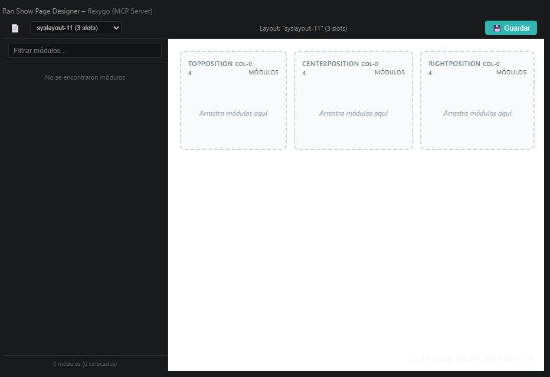

# Herramientas y recursos MCP

El servidor `flexygo-mcp` expone herramientas y recursos que el agente de Copilot puede invocar para interactuar con el proyecto Flexygo Core. No es necesario conocerlas todas — el agente las descubre y usa automáticamente según el contexto del prompt.

---

## Explorar las herramientas disponibles

Una vez que el servidor está activo, el archivo `.vscode/mcp.json` muestra el número total de herramientas y prompts disponibles. Haz clic en **More...** para ver el listado completo directamente en VS Code.

<figure markdown="span">
  
  <figcaption>Haz clic en More... para explorar todas las herramientas disponibles</figcaption>
</figure>

---

## MCP Apps

Además de las herramientas de datos, el servidor incluye tres **MCP Apps**: interfaces visuales interactivas que el agente puede abrir en respuesta a prompts específicos.

<figure markdown="span">
  
  <figcaption>Las 3 MCP Apps aparecen como recursos en el panel del agente</figcaption>
</figure>

### Flexygo Schema Diagram UI

Diagrama interactivo del modelo de base de datos del proyecto, con jerarquía y relaciones entre entidades. Útil para visualizar el esquema actual antes de hacer cambios o para entender la estructura de un proyecto existente.

**Cómo usarlo:**
```text
Muéstrame el modelo de base de datos actual del proyecto
```

<figure markdown="span">
  
  <figcaption>El diagrama muestra tablas, columnas, tipos y claves foráneas del proyecto</figcaption>
</figure>

### Color Picker UI

Selector de color interactivo. Al confirmar un color, el agente modifica automáticamente las dos variables principales de la aplicación: el color de cabecera y el color de navegación.

**Cómo usarlo:**
```text
Cambia el color principal de la aplicación a un azul corporativo oscuro usando el color picker
```

<figure markdown="span">
  
  <figcaption>Selecciona el color y pulsa "Aplicar color al proyecto" para que el agente aplique el cambio</figcaption>
</figure>

### Flexygo Page Designer UI

Previsualización del diseñador de páginas: muestra las posiciones disponibles (slots) de cada página y los módulos configurados en cada una. Útil para revisar el layout antes de realizar modificaciones.

**Cómo usarlo:**
```text
Abre el diseñador de páginas para ver qué módulos hay en cada página
```

<figure markdown="span">
  
  <figcaption>El diseñador muestra el layout de la página seleccionada con sus posiciones y módulos asignados</figcaption>
</figure>
