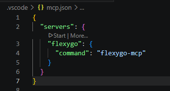
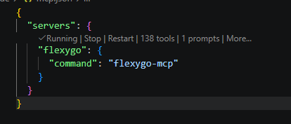
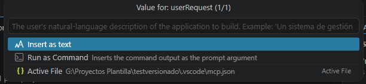
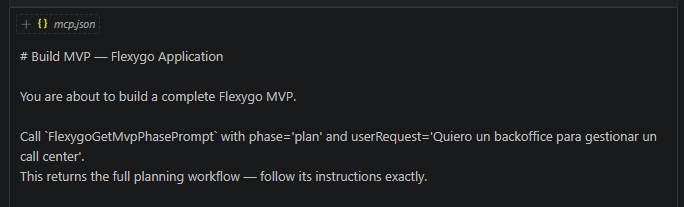

# Uso básico del servidor MCP

Una vez cumplidos los [prerrequisitos](prerequisitos.md), el proyecto ya incluye todo lo necesario para arrancar el servidor MCP directamente desde VS Code.

---

## Arrancar el servidor desde VS Code

El proyecto generado desde la plantilla de Flexygo Core incluye un archivo `.vscode/mcp.json` preconfigurado:

```json
{
  "servers": {
    "flexygo": {
      "command": "flexygo-mcp"
    }
  }
}
```

Abre ese archivo en VS Code y haz clic en **Start** para arrancar el servidor.

<figure markdown="span">
  
  <figcaption>El archivo mcp.json incluye el enlace Start directamente en el editor</figcaption>
</figure>

Cuando el servidor esté activo, el archivo muestra el estado **Running** junto al número de herramientas y prompts disponibles.

<figure markdown="span">
  
  <figcaption>El servidor está listo cuando aparece Running con el recuento de herramientas</figcaption>
</figure>

!!! tip "El servidor debe estar activo antes de usar el agente"
    Arranca siempre el servidor MCP antes de abrir el chat de Copilot en modo agente. Si Copilot ya estaba abierto cuando arrancaste el servidor, recarga la ventana de VS Code (`Ctrl+Shift+P` → **Developer: Reload Window**).

---

## Flujo /build-mvp

Una vez conectado el servidor, el flujo principal de trabajo es crear un producto Flexygo Core desde cero usando el prompt `/build-mvp`. Este prompt activa un flujo orquestado en el que el agente guía todo el proceso.

### Cómo iniciarlo

En el modo agente de GitHub Copilot, lanza el prompt con una descripción mínima de lo que quieres construir:

<figure markdown="span">
  
  <figcaption>El agente solicita una descripción de la aplicación a construir</figcaption>
</figure>

```text
/build-mvp Quiero un backoffice para gestionar un call center
```

Cuanto más concreto seas en la descripción inicial, mejor partirá el agente.

<figure markdown="span">
  
  <figcaption>El agente arranca el flujo orquestado de construcción del producto</figcaption>
</figure>

### Fases del flujo

**1. Análisis y modelo de datos**

El agente analiza el dominio descrito y presenta una propuesta de modelo de datos: entidades, propiedades, relaciones y tipos. En este punto puedes revisar y ajustar lo que consideres antes de continuar.

**2. Estilo visual**

Una vez confirmado el modelo de datos, el agente solicita las preferencias de estilo: tipografía, colores principales y cualquier directriz visual relevante para el producto.

**3. Plan de implementación**

Con el modelo y el estilo confirmados, el agente genera un plan de implementación completo en forma de checklist: todo lo que va a crear (objetos, propiedades, relaciones, configuraciones) antes de ejecutar ningún cambio. Puedes revisarlo y pedir ajustes.

**4. Generación del producto**

El agente ejecuta el plan orquestando subagentes para preservar la ventana de contexto. Crea la estructura completa del producto de forma autónoma.

**5. Verificación**

Al finalizar, el agente realiza verificaciones automáticas para comprobar que todo lo generado es correcto y coherente.

**6. Scripts de migración (opcional)**

Como paso final, se ofrece la posibilidad de generar scripts tanto para la base de datos de configuración como para la de datos, listos para aplicar al proyecto actual.

!!! tip "Consejos para mejores resultados"
    Consulta los [Tips con Copilot](tips-copilot.md) para recomendaciones sobre el modelo a usar y patrones de prompting que mejoran la calidad del resultado.
