# Extensiones IDE

La extensión **Flexygo Developer Tools** está disponible para Visual Studio 2022 y VS Code. Permite generar los paquetes NuGet de tu producto y actualizar la solución a nuevas versiones de Flexygo Core, todo desde la interfaz del IDE sin necesidad de usar la línea de comandos.

=== "VS Code *(recomendado)*"

    ## Instalación

    1. Abre VS Code.
    2. Ve a la vista **Extensiones** (<kbd>Ctrl+Shift+X</kbd>).
    3. Busca `Flexygo Developer Tools` y haz clic en **Instalar**.

       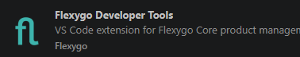
       <em class="caption">Extensión Flexygo Developer Tools en el marketplace de VS Code</em>

    Una vez instalada, los comandos están disponibles desde **dos lugares**:

    - Los **iconos de la barra de herramientas** (parte superior derecha de la ventana).

      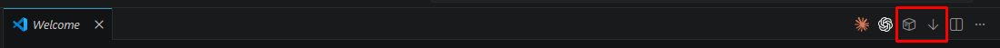
      <em class="caption">Icono de generar NuGets (caja) e icono de actualizar (flecha)</em>

    - El **menú contextual** al hacer clic derecho sobre la carpeta raíz del proyecto en el explorador.

      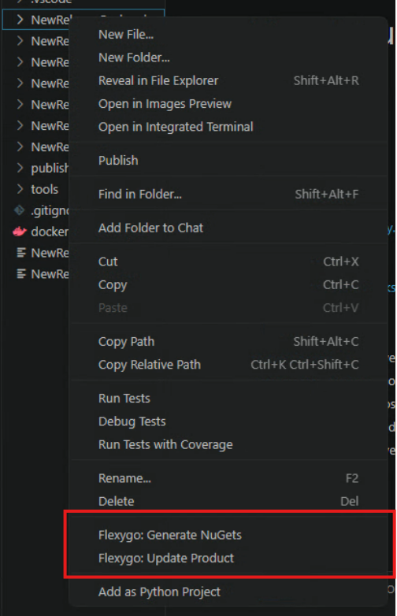
      <em class="caption">Opciones de Flexygo en el menú contextual del explorador</em>

    ## Actualizar el producto

    1. Usa el icono de actualizar en la barra o **Flexygo: Update Product** en el menú contextual.
    2. Selecciona la versión a la que deseas actualizar; por defecto aparece la última disponible.

       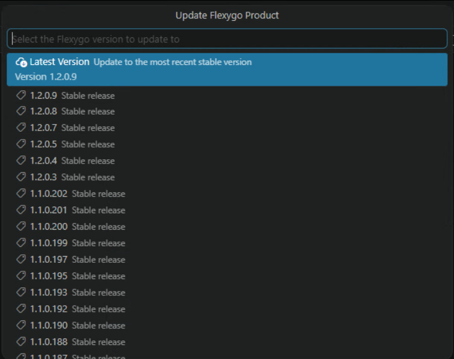
       <em class="caption">Selector de versión — Latest Version selecciona la más reciente</em>

    ## Generar NuGets

    1. Usa el icono de NuGet en la barra o **Flexygo: Generate NuGets** en el menú contextual.
    2. Introduce la versión del paquete NuGet que quieres generar y pulsa <kbd>Enter</kbd>.

       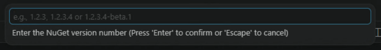
       <em class="caption">Introduce el número de versión (ej: 1.2.3 o 1.2.3-beta.1)</em>

    3. Al finalizar se abrirá la carpeta con los paquetes generados.

=== "Visual Studio 2022"

    ## Instalación

    1. Abre Visual Studio.
    2. Ve al menú **Extensiones** y selecciona **Administrar extensiones**.
    3. En la ventana de búsqueda, escribe `Flexygo Developer Tools`.
    4. Cuando aparezca la extensión en los resultados, haz clic en **Descargar**.
    5. Reinicia Visual Studio para completar la instalación.

    Una vez instalada, encontrarás la barra de herramientas en **Ver** → **Barras de herramientas** → **Flexygo Core Tools Product**.

    
    <em class="caption">Barra de herramientas con los botones de actualizar y generar NuGets</em>

    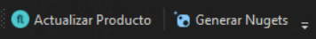
    <em class="caption">Botón de actualizar (izquierda) y generar NuGets (derecha)</em>

    ## Actualizar el producto

    1. Haz clic en el botón de actualizar en la barra de herramientas.
    2. Selecciona la versión a la que deseas actualizar; por defecto aparece la última disponible.

       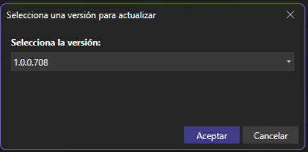

    3. Confirma la actualización en la ventana de confirmación.

       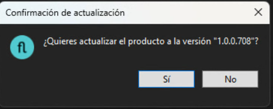

    4. Sigue el progreso en la pestaña de salida.

       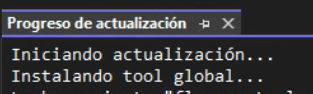

    ## Generar NuGets

    1. Haz clic en el botón de generar NuGets en la barra de herramientas.
    2. Introduce la versión del paquete NuGet que quieres generar.

       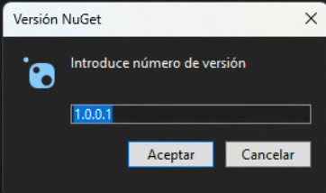

    3. Confirma la generación en la ventana de confirmación.

       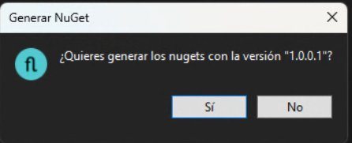

    4. Sigue el progreso en la pestaña de salida. Al finalizar se abrirá la carpeta con los paquetes generados.

       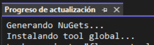