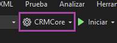
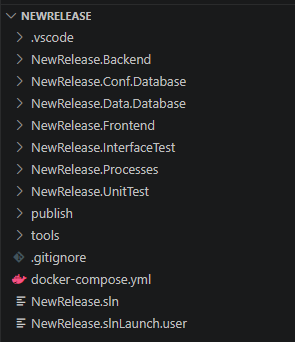
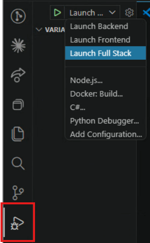

# Crear un producto con Flexygo Core

La plantilla de Flexygo Core genera una solución lista para comenzar el desarrollo de inmediato, con todos los proyectos y configuraciones necesarios integrados.

!!! tip "Forma recomendada"
    La manera más sencilla de crear un nuevo producto es a través del **[Instalador de Flexygo Core](../despliegue/instalacion-desarrollo.md)**, que guía el proceso con una interfaz gráfica y configura todo automáticamente. Las secciones 1 y 2 de esta página describen la alternativa por línea de comandos para quienes prefieran ese flujo.

---

## 1. Gestión de la plantilla (CLI)

### Instalación y actualización

Para instalar o actualizar a la última versión disponible de la plantilla:

```bash
dotnet new install Flexygo.Product.Template --nuget-source https://nuget.ahorabh.com/v3/index.json --force
```

### Eliminación de la plantilla

Para desinstalarla:

```bash
dotnet new uninstall Flexygo.Product.Template
```

---

## 2. Creación de un nuevo producto (CLI)

```bash
dotnet new flexygoproduct --name CRMCore --output "G:\Proyectos Plantilla\CRMCore" --allow-scripts yes
```

> Cambia `CRMCore` por el nombre de tu producto y la ruta por donde quieras generar el proyecto.

Al crear el producto, se generará automáticamente un **perfil de ejecución** en Visual Studio con el mismo nombre de proyecto indicado. Recuerda seleccionar ese perfil en la parte superior de Visual Studio para ejecutar el proyecto correctamente.


<em class="caption">Selector de perfil de ejecución en Visual Studio</em>

---

## 3. Estructura de la solución generada

Al crear un nuevo producto se genera una solución organizada con los siguientes proyectos:


<em class="caption">Estructura de la solución generada por la plantilla</em>

| Proyecto | Descripción |
|----------|-------------|
| **`{Nombre}.Frontend`** | Archivos cliente (JS, CSS, HTML…) servidos en el navegador |
| **`{Nombre}.Backend`** | DLLs personalizadas y lógica de negocio del producto |
| **`{Nombre}.Processes`** | Procesos personalizados en C# del producto |
| **`{Nombre}.Conf.Database`** | Base de datos de configuración — metadatos de la aplicación |
| **`{Nombre}.Data.Database`** | Base de datos de datos — tablas y objetos de negocio |
| **`{Nombre}.UnitTest`** | Tests unitarios sobre la lógica de backend |
| **`{Nombre}.InterfaceTest`** | Tests automáticos de interfaz y flujos de usuario |

Los proyectos **Frontend**, **Backend**, **Processes** y los de **base de datos** incluyen un archivo `.nuspec` preconfigurado para generar los paquetes NuGet correspondientes. Revísalos y adáptalos si necesitas añadir dependencias o metadatos adicionales.

### Convención de nombres NuGet

Para que el instalador detecte correctamente los paquetes de tu producto, deben seguir la misma convención de nombres que los proyectos de la solución:

| Paquete NuGet | Proyecto origen |
|---------------|-----------------|
| `{Nombre}.Frontend` | `{Nombre}.Frontend` |
| `{Nombre}.Backend` | `{Nombre}.Backend` |
| `{Nombre}.Library` | `{Nombre}.Processes` |
| `{Nombre}.Conf.Database` | `{Nombre}.Conf.Database` |
| `{Nombre}.Data.Database` | `{Nombre}.Data.Database` |

Con esta convención el instalador los detecta automáticamente. Si hay varias versiones disponibles, mostrará una lista desplegable para elegir la versión a instalar.

---

## 4. Pasos para comenzar a desarrollar

=== "VS Code *(recomendado)*"

    1. Abre VS Code y usa **File > Open Folder** para abrir la **carpeta raíz** del proyecto (la que contiene el `.gitignore` y el `docker-compose.yml`).

    2. Abre la pestaña **Run and Debug** (<kbd>Ctrl+Shift+D</kbd>) y selecciona el perfil **Full Stack**.

       
       <em class="caption">Selección del perfil Full Stack en VS Code</em>

    3. Elige cómo configurar el proyecto antes de lanzarlo:

        - **Con el Asistente de configuración** *(recomendado)*: pulsa el botón de inicio. Al no detectar configuración, Flexygo abrirá automáticamente el [Asistente de configuración](../despliegue/configuracion.md), que publicará las bases de datos y ajustará el `appsettings.json` por ti.
        - **Manualmente**: publica los proyectos `{NombreDelProyecto}.Conf.Database` y `{NombreDelProyecto}.Data.Database`, completa las cadenas de conexión en el `appsettings.json` del Backend y establece `configured: true` en la sección `MailSettings`. Al pulsar inicio irás directamente al login sin pasar por el asistente.

=== "Visual Studio 2022"

    1. Abre la solución generada (`{NombreDelProyecto}.sln`) con Visual Studio 2022.

    2. Compila la solución completa (**Build > Build Solution**) para restaurar paquetes y verificar que no hay errores.

    3. Selecciona el perfil de ejecución generado en el selector de la barra superior.

       
       <em class="caption">Selector de perfil de ejecución en Visual Studio</em>

    4. Elige cómo configurar el proyecto antes de lanzarlo:

        - **Con el Asistente de configuración** *(recomendado)*: ejecuta el proyecto. Al no detectar configuración, Flexygo abrirá automáticamente el [Asistente de configuración](../despliegue/configuracion.md), que publicará las bases de datos y ajustará el `appsettings.json` por ti.
        - **Manualmente**: publica los proyectos `{NombreDelProyecto}.Conf.Database` y `{NombreDelProyecto}.Data.Database`, completa las cadenas de conexión en el `appsettings.json` del Backend y establece `configured: true` en la sección `MailSettings`. Al ejecutar el proyecto irás directamente al login sin pasar por el asistente.

!!! tip "Siguientes pasos"
    Consulta [Gestión de producto](gestionproducto.md) para entender la estructura de NuGets, versiones y el ciclo de vida del producto.