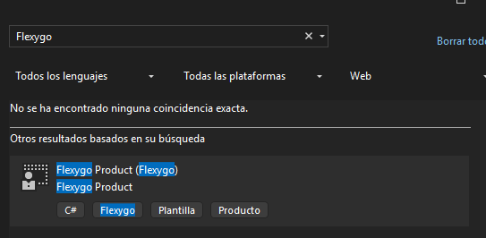

# Crear un producto con Flexygo Core
La nueva plantilla para productos de Flexygo Core permite generar una solución lista para comenzar el desarrollo de inmediato, con todo lo necesario integrado.

---

## 1. Gestión de la plantilla

### Instalación y actualización
Para instalar la última versión disponible de la plantilla y actualizarla:
```bash
dotnet new install Flexygo.Product.Template --nuget-source https://nuget.ahorabh.com/v3/index.json --force
```

### Eliminación de la plantilla

En caso de que desees desinstalarla:

```bash
dotnet new uninstall Flexygo.Product.Template
```

---

## 2. Creación de un nuevo producto

### Crear un producto desde línea de comandos

Para crear un nuevo producto basado en la plantilla:

```bash
dotnet new flexygoproduct --name CRMCore --output "G:\Proyectos Plantilla\CRMCore" --allow-scripts yes
```

> Cambia `CRMCore` por el nombre de tu producto y la ruta `G:\Proyectos Plantilla\CRMCore` por donde quieras generar el proyecto.

Al crear el producto, se generará automáticamente un **perfil de ejecución** en Visual Studio con el mismo nombre de proyecto que hayas indicado. Por tanto, **recuerda seleccionar ese perfil en la parte superior del Visual Studio** para ejecutar el proyecto correctamente.


<em class="caption">Selector de perfil de ejecución en Visual Studio</em>

### Crear un producto desde Visual Studio

Tras instalar la plantilla, también puedes crear un nuevo producto **directamente desde la interfaz de Visual Studio**:

1. Abre Visual Studio.
2. Haz clic en **Crear un nuevo proyecto**.
3. Busca “Flexygo” en el cuadro de búsqueda.
4. Selecciona la plantilla `Flexygo Product`.
5. Introduce el nombre de tu producto y la ubicación donde quieres crearlo.
6. Haz clic en **Crear**.


<em class="caption">Selecciona la plantilla Flexygo en Visual Studio para crear tu producto desde la interfaz</em>

!!! tip "Próximamente" 
    Esta funcionalidad estará disponible también en el instalador de Flexygo Core,  donde podrás crear nuevos productos fácilmente desde una interfaz gráfica ¡sin necesidad de usar comandos!

---

## 3. ¿Qué encontrarás en la solución generada?

Al crear un nuevo producto con la plantilla de Flexygo Core, se genera una solución organizada con los siguientes proyectos principales:

- **Frontend**: Contiene todos los archivos necesarios para la parte cliente (JS, CSS, HTML, etc.), que serán servidos en el navegador.
- **Backend**: Aquí se alojan las DLL personalizadas y la lógica de negocio principal del producto.
- **Base de datos de datos (`*_DataDB`)**: Proyecto de base de datos donde se almacenan las tablas y objetos relacionados con los datos de negocio.
- **Base de datos de configuración (`*_DB`)**: Proyecto de base de datos para toda la configuración y metadatos de la aplicación.
- **Unit Tests**: Proyecto dedicado a los tests unitarios sobre la lógica de backend.
- **Interface Tests**: Proyecto para tests automáticos de interfaz y flujos de usuario.

Además, cada proyecto incluye un archivo .nuspec ya preparado con la configuración mínima necesaria para poder generar los paquetes NuGet correspondientes.
Revisa estos archivos .nuspec y adáptalos si necesitas añadir dependencias, metadatos o personalizaciones adicionales para tu producto.

Así tendrás todo lo necesario para empezar a desarrollar y probar tu producto desde el primer momento.
    
---

## 4. Pasos para comenzar a desarrollar

Una vez generado el producto:

1. Abre la solución generada con Visual Studio.
2. Compila la solución completa.
3. Publica los proyectos de base de datos:  
    - `{NombreDelProyecto}_DB`  
    - `{NombreDelProyecto}_DataDB`
4. ¡Listo! Ya puedes empezar a desarrollar sobre tu nuevo producto Flexygo Core.

