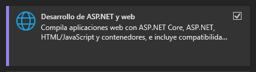
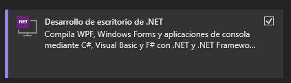
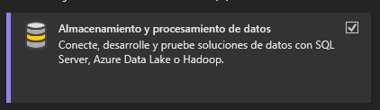
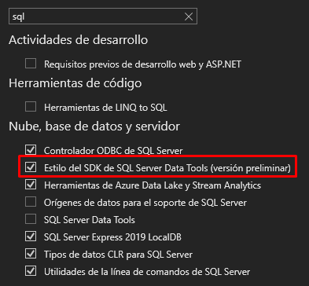

## Requisitos previos para el desarrollo

Antes de empezar a trabajar con un producto generado por la plantilla Flexygo Core, asegúrate de tener instalado lo siguiente:

**Visual Studio 2022 Preview**  
- Instala la versión *Preview* de Visual Studio 2022 y selecciona:
    - Las siguientes cargas de trabajo.
        
        
        
    - La característica **SDK-style SQL Projects** y tener deshabilitada **SQL Server Data Tools** ya que ambas no son compatibles.
        

**SQL Server 2022**  
  - Debes tener una instancia local o accesible de SQL Server 2022 para poder desplegar y trabajar con los proyectos de base de datos.

!!! warning "Importante"
    Es recomendable mantener tanto Visual Studio como SQL Server actualizados para evitar incompatibilidades o problemas con los últimos paquetes y herramientas.

