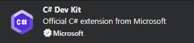
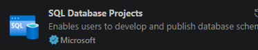

## Requisitos previos para el desarrollo

Antes de empezar a trabajar con un producto generado por la plantilla **Flexygo Core**, asegúrate de tener instalado lo siguiente:

---

!!! note "Versiones de .NET"
    Los proyectos Flexygo Core requieren **.NET 9 SDK**. Si además vas a usar el servidor MCP (`flexygo-mcp`), este requiere **.NET 10 SDK** — consulta la sección [MCP › Prerrequisitos](../mcp/prerequisitos.md) para más detalle.

    Descarga desde [dotnet.microsoft.com](https://dotnet.microsoft.com/download).

### **SQL Server 2016 o superior**

Debes tener una instancia local o accesible de **SQL Server 2016 o superior** para poder desplegar y trabajar con los proyectos de base de datos. La edición gratuita **SQL Server Express** es suficiente para entornos de desarrollo.

---

## IDE de desarrollo

=== "VS Code *(recomendado)*"

    La opción recomendada para trabajar con proyectos Flexygo Core.

    ### Extensiones necesarias

    Instala las siguientes extensiones desde el Marketplace de VS Code:

    - **C# Dev Kit** — soporte completo de C#, IntelliSense y depuración

      
      <em class="caption">Extensión C# Dev Kit</em>

    - **SQL Database Projects** — gestión y despliegue de proyectos de base de datos

      
      <em class="caption">Extensión SQL Database Projects</em>

    - **Flexygo Developer Tools** — herramientas específicas para proyectos Flexygo Core

      
      <em class="caption">Extensión Flexygo Developer Tools</em>

    ### Node.js (requerido para compilar el Frontend)

    Necesitas tener **Node.js** instalado en tu sistema.

    !!! danger "Opción PATH global obligatoria"
        Durante la instalación de Node.js, **debes marcar la opción de añadir Node al PATH global del sistema**. Si no se activa esta opción, el compilador del Frontend no encontrará los binarios de Node y la compilación fallará.

        Puedes verificarlo ejecutando en una terminal:
        ```bash
        node --version
        npm --version
        ```
        Si ambos comandos devuelven un número de versión, la instalación es correcta.

    Descarga la versión LTS desde [nodejs.org](https://nodejs.org/).

=== "Visual Studio 2022"

    Alternativa válida para quienes prefieran el IDE completo de Microsoft.

    ### Cargas de trabajo

    Durante la instalación o modificación de Visual Studio, selecciona las siguientes **cargas de trabajo**:

    
    
    

    ### Componentes individuales

    En **Componentes individuales**, marca **SDK-style SQL Projects** y **deshabilita SQL Server Data Tools**, ya que ambas no son compatibles:

    

    ### Extensión Flexygo Developer Tools

    Instala la extensión **Flexygo Developer Tools** desde el Marketplace de Visual Studio. Proporciona las mismas herramientas de gestión de producto disponibles en VS Code.

    !!! warning "Visual Studio 2026"
        Visual Studio 2026 **no incluye la característica _SDK-style SQL Projects_**, por lo que no puede usarse para crear ni modificar los proyectos de base de datos de Flexygo Core.