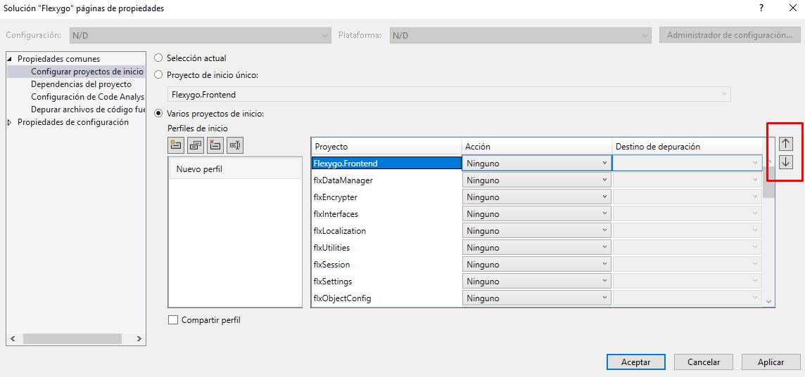
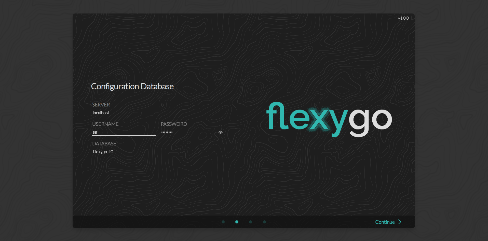
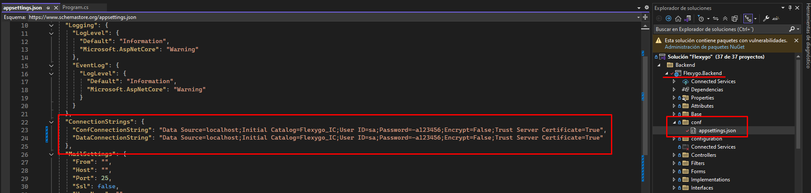

# Desarrollo en Flexygo

## Ramas de Core

Para empezar a trabajar debes tener en cuenta que estamos trabajando sobre las ramas `flexygo-core-develop` y `flexygo-core-master`.

Sitúate sobre la que debas.

## Abrir la solución

> **Nota:** Sustituye `{REPO_ROOT}` por la ruta local donde hayas clonado el repositorio de Flexygo.

Una vez en la rama podrás ver que la estructura de ficheros ahora es algo diferente, dividiéndose en backend y frontend, es por ello que tienes que abrir la solución que contiene a ambas en `{REPO_ROOT}\Flexygo.sln`.

## Generar links

Mientras esperamos a que la solución se abra, o una vez ya abierta, ejecutamos el archivo `{REPO_ROOT}\GenerarLinks.bat`, ten en cuenta que te pedirá permisos de administrador.

## Iniciar el proyecto

Una vez abierto el proyecto te preguntarás como iniciar flexygo, ya que ahora son dos programas, para ello hace falta crearte un perfil personalizado siguiendo los siguientes pasos:

- Click derecho en la **solución** y vas a **propiedades**

{ width="250px"}

- En la categoría **Configurar proyectos de Inicio** dentro de Propiedades comunes seleccionamos **Varios proyectos de inicio**

- Debes buscar **Flexygo.Backend** y **Flexygo.Frontend** y situarlos los primeros, en ese mismo orden, seleccionando y utilizando los botones flecha para moverlos

- Una vez **Flexygo.Backend** y **Flexygo.Frontend** estén arriba del todo los dos primeros respectivamente debes marcar la acción de **Inicio** en estos

- Ahora además si quieres puedes cambiarle el nombre del perfil utilizando este botón, pero esto no afectará en nada funcional

- Una vez hecho todo esto ya solo queda clickar los botones **aplicar** y **aceptar** para guardar los cambios y ya podrás iniciar el proyecto desde el botón iniciar o con el f5.

## Elegir BBDDs

En core puedes iniciar el proyecto sin añadir las BBDDs al fichero de configuración, en cuyo caso se te pedirán mediante el asistente de inicio de flexygo tal que así:

En el caso de que quisieras añadirlas antes de iniciar, debes saber que ya no se utiliza el `web.config` ahora debes utilizar el fichero `appsettings.json` del backend. Y se añadirían en la sección de ConnectionStrings como siempre, tal y como se ve en la imagen.

