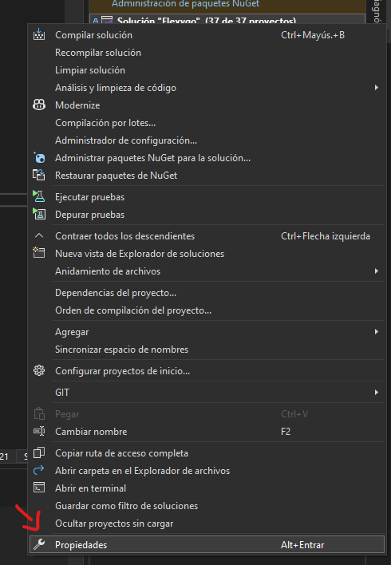
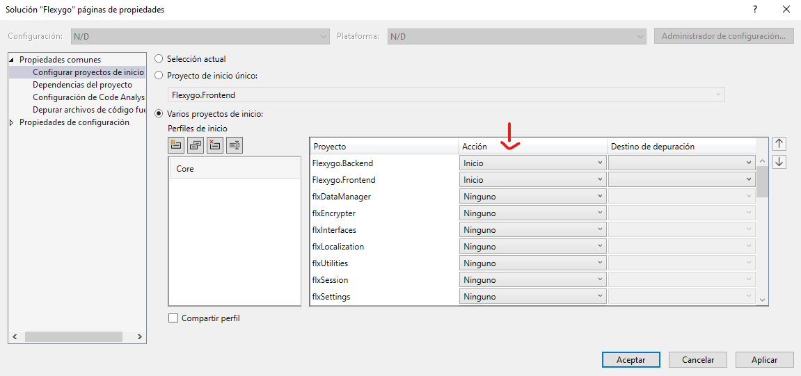
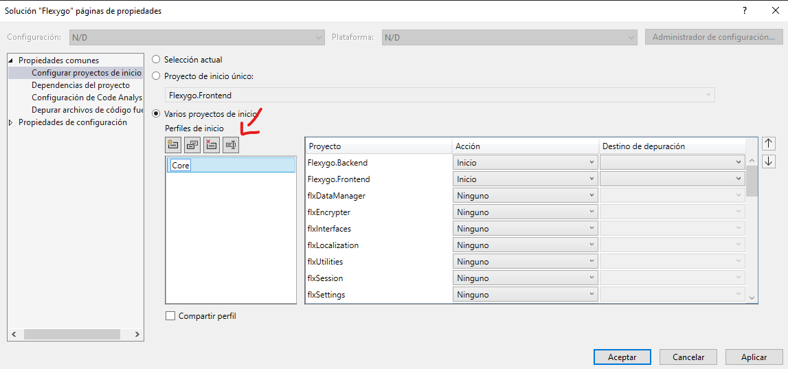

# Dessarrollo en flexygo

## Ramas de Core

Para empezar a trabajar debes tener en cuenta que estamos trabajando sobre las ramas `flexygo-core-develop` y `flexygo-core-master`.

Situate sobre la que debas.

## Abrir la solución

Una vez en la rama podrás ver que la estructura de ficheros ahora es algo diferente, dividiendose en backend y frontend, es por ello que tienes que abrir la solución que contiene a ambas en `C:\Codigo GIT\Flexygo\flexygo\Flexygo.sln`.

## Generar links

Mientras esperamos a que la solución se abra, o una vez ya abierta, ejecutamos el archivo `C:\Codigo GIT\Flexygo\flexygo\GenerarLinks.bat`, ten en cuenta que te pedirá permisos de administrador.

## Iniciar el proyecto

Una vez abierto el proyecto te preguntarás como iniciar flexygo, ya que ahora son dos programas, para ello hace falta crearte un perfil personalizado siguiendo los siguientes pasos:

- Click derecho en a solución (propiedades -> Varios Proyectos de Inicio)

- Debes buscar Flexygo.Backend y Flexygo.Frontend y situarlos los primeros, en ese mismo order, utilizando las flechas para moverlos

- Una vez Flexygo.Backend y Flexygo.Frontend estén arriba del todo los dos primeros respectivamente

- Ahora además si quieres puedes cambiarle el nombre del perfil utilizando este botón, pero esto no afectará en nada funcional

- Una vez hecho todo esto ya solo queda clickar los botones aplicar y aceptar para guardar los cambios y ya podrás iniciar el proyecto desde el botón iniciar o con el f5.